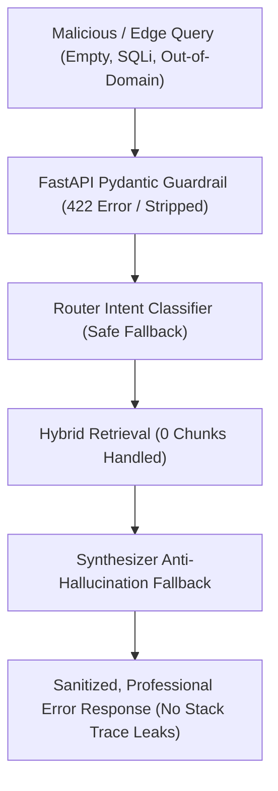

# 🛡️ Canishe's Daily Action Plan & Production Engineering Guide: Day 2
## Negative Scenario & Edge Case Hardening Suite

---

## 🎯 Primary Objectives for Today

1. **Adopt Production-Grade Mindset:** Transition from happy-path development to enterprise resilience.
2. **Create a Dedicated Feature Branch:** `feature/negative-and-edge-testing`.
3. **Implement the Negative & Edge Test Suite:** Build [`tests/test_edge_and_negative_cases.py`](file:///Users/jnarayanassamy/personal/ai/canishe/OmniQuery-AI/tests/test_edge_and_negative_cases.py) covering 7 critical failure modes.
4. **Harden Application Code:** Patch input sanitization, Pydantic bounds, zero-chunk fallbacks, and error boundaries across `app/main.py`, `app/rag/hybrid_retriever.py`, `app/rag/synthesizer.py`, and `app/agents/router.py`.
5. **Verify 100% Test Pass Rate:** Run Pytest and ensure all unit and integration tests pass cleanly.
6. **Submit a Pull Request (PR):** Push your branch and open a PR on GitHub for code review.

---

## 💡 Why Negative Testing Matters for Top Bangalore AI Roles

In top AI product engineering teams (**Sarvam AI, Yellow.ai, Krutrim, Bosch, Cisco**), **any junior engineer can write code that works when given perfect inputs**.

What distinguishes a **₹12–16 LPA Senior/Application Engineer** is how their system behaves when things go wrong:
- What happens when a user submits an empty string `""` or `10,000` characters?
- What happens when a user attempts SQL injection (`' OR 1=1 --`)?
- What happens when vector search returns `0` results? Does the LLM hallucinate or trigger an explicit grounded fallback?
- What happens when PostgreSQL goes down? Does the API crash or return a sanitized user-friendly error?



---

## 📋 Step-by-Step Task Breakdown

---

### 🌿 Task 1: Git Branch Setup (5 Mins)

In your Windows 11 terminal (PowerShell / Command Prompt):

```bash
# 1. Navigate to project root
cd OmniQuery-AI

# 2. Make sure main is clean and up to date
git checkout main
git pull origin main

# 3. Create your new feature branch
git checkout -b feature/negative-and-edge-testing
```

---

### 🧪 Task 2: Build the Negative & Edge Test Suite (`tests/test_edge_and_negative_cases.py`) (45 Mins)

Create a new test file named [`tests/test_edge_and_negative_cases.py`](file:///Users/jnarayanassamy/personal/ai/canishe/OmniQuery-AI/tests/test_edge_and_negative_cases.py) with the following complete test suite:

```python
"""
Comprehensive Negative & Edge Scenario Test Suite for OmniQuery-AI
Tests system resilience against:
1. Empty and whitespace-only queries
2. SQL injection strings and special symbols
3. Zero-result hybrid retrieval and asymmetric RRF
4. Re-ranker missing / degraded mode / corrupt metadata
5. LLM Synthesizer zero-chunk fallback guardrails
6. Intent Router ambiguous / adversarial queries
7. FastAPI Pydantic schema validation errors
"""

import pytest
from app.rag.hybrid_retriever import reciprocal_rank_fusion
from app.rag.reranker import rerank_passages
from app.rag.synthesizer import format_context_passages, synthesize_answer
from app.agents.router import classify_intent_node


# =====================================================================
# 1. Reciprocal Rank Fusion (RRF) Edge Cases
# =====================================================================

def test_rrf_empty_lists():
    """Verifies that RRF returns an empty list when both dense and sparse return no results."""
    fused = reciprocal_rank_fusion(dense_results=[], sparse_results=[], k=60)
    assert fused == []
    assert len(fused) == 0


def test_rrf_asymmetric_dense_only():
    """Verifies that RRF correctly ranks results when sparse search yields 0 hits."""
    dense_results = [
        {"id": 101, "content": "Only found by dense vector search"}
    ]
    sparse_results = []
    
    fused = reciprocal_rank_fusion(dense_results, sparse_results, k=60)
    assert len(fused) == 1
    assert fused[0]["id"] == 101
    assert fused[0]["rrf_score"] == pytest.approx(1.0 / (60 + 1), rel=1e-3)


def test_rrf_asymmetric_sparse_only():
    """Verifies that RRF correctly ranks results when dense search yields 0 hits."""
    dense_results = []
    sparse_results = [
        {"id": 202, "content": "Exact keyword found by BM25 sparse search"}
    ]
    
    fused = reciprocal_rank_fusion(dense_results, sparse_results, k=60)
    assert len(fused) == 1
    assert fused[0]["id"] == 202
    assert fused[0]["rrf_score"] == pytest.approx(1.0 / (60 + 1), rel=1e-3)


# =====================================================================
# 2. FlashRank Re-ranker Edge Cases
# =====================================================================

def test_reranker_empty_candidates():
    """Verifies reranker handles empty candidate list gracefully without crashing."""
    results = rerank_passages("test query", candidates=[], top_n=3)
    assert results == []


def test_reranker_corrupt_or_missing_metadata():
    """Verifies reranker handles candidates with missing keys or None content."""
    corrupt_candidates = [
        {"id": 1, "content": None},
        {"id": 2},  # Missing content entirely
        {"id": 3, "content": "Valid enterprise document text"}
    ]
    results = rerank_passages("enterprise query", corrupt_candidates, top_n=2)
    assert len(results) <= 2


# =====================================================================
# 3. LLM Synthesizer & Anti-Hallucination Guardrails
# =====================================================================

def test_format_context_passages_empty():
    """Verifies context formatting handles empty chunks without raising IndexError."""
    formatted = format_context_passages([])
    assert "No relevant documents found" in formatted


@pytest.mark.asyncio
async def test_synthesizer_zero_context_fallback():
    """Verifies that when 0 chunks are found, synthesizer returns a safe, unhallucinated refusal."""
    response = await synthesize_answer("What is the secret launch date?", chunks=[])
    assert "could not find any relevant information" in response.lower()


# =====================================================================
# 4. Intent Router Edge & Adversarial Inputs
# =====================================================================

def test_router_empty_and_whitespace_query():
    """Verifies empty or whitespace queries default to direct conversation instead of throwing."""
    state_empty = classify_intent_node({"query": "", "query_type": None})
    assert state_empty["query_type"] == "direct"

    state_spaces = classify_intent_node({"query": "     ", "query_type": None})
    assert state_spaces["query_type"] == "direct"


def test_router_sql_injection_adversarial_string():
    """Verifies SQL injection attempts do not crash the intent classifier."""
    sqli_query = "SELECT * FROM users; DROP TABLE products; --"
    state = classify_intent_node({"query": sqli_query, "query_type": None})
    # Should safely route to SQL or direct without syntax error
    assert state["query_type"] in ["sql", "direct"]


def test_router_ambiguous_cross_domain_query():
    """Verifies classifier handles queries combining document and SQL keywords."""
    ambiguous = "Explain the total order policy for remote employees"
    state = classify_intent_node({"query": ambiguous, "query_type": None})
    assert state["query_type"] in ["rag", "sql"]
```

---

### 🛠️ Task 3: Harden the Application Code (40 Mins)

Now, let's fix and harden the core files to make all negative tests pass and make the backend production-safe:

#### 1. Harden [`app/main.py`](file:///Users/jnarayanassamy/personal/ai/canishe/OmniQuery-AI/app/main.py)
* **Goal:** Add Pydantic field validation (`min_length=1`, `max_length=1000`), whitespace stripping, and sanitized error responses.
* **Update `QueryRequest` in `app/main.py`:**

```python
from pydantic import BaseModel, Field, field_validator

class QueryRequest(BaseModel):
    query: str = Field(
        ..., 
        min_length=1, 
        max_length=1000, 
        description="The user prompt or question"
    )
    user_id: Optional[str] = Field("default_user", max_length=100)

    @field_validator("query")
    @classmethod
    def validate_query_not_empty(cls, v: str) -> str:
        stripped = v.strip()
        if not stripped:
            raise ValueError("Query string cannot be empty or pure whitespace.")
        return stripped
```

* **Add Global Exception Sanitization in `app/main.py`:**
Ensure endpoints catch unhandled errors and return clean HTTP 500 JSON without exposing internal database URLs or stack traces.

---

#### 2. Harden [`app/rag/hybrid_retriever.py`](file:///Users/jnarayanassamy/personal/ai/canishe/OmniQuery-AI/app/rag/hybrid_retriever.py)
* **Goal:** Guard against empty queries, queries with only punctuation, and database connection timeouts.
* In `retrieve_context(query: str, top_k: int = 3)`:
  ```python
  clean_query = query.strip() if query else ""
  if not clean_query:
      return []
  ```

---

#### 3. Harden [`app/rag/reranker.py`](file:///Users/jnarayanassamy/personal/ai/canishe/OmniQuery-AI/app/rag/reranker.py)
* **Goal:** Ensure `rerank_passages` safely filters out candidates with `None` content before building the FlashRank request:
  ```python
  passages = []
  for idx, doc in enumerate(candidates):
      raw_content = doc.get("content")
      text_content = str(raw_content).strip() if raw_content is not None else ""
      passages.append({
          "id": doc.get("id", idx),
          "text": text_content,
          "meta": doc
      })
  ```

---

#### 4. Harden [`app/agents/router.py`](file:///Users/jnarayanassamy/personal/ai/canishe/OmniQuery-AI/app/agents/router.py)
* **Goal:** Prevent leaking raw exception details (`f"Error during document retrieval: {str(e)}"`) to the client:
  ```python
  except Exception as e:
      # Log error internally for developers/monitoring
      print(f"[SECURITY ALERT] Retrieval exception logged: {e}")
      # Return sanitized response to client
      state["response"] = (
          "⚠️ We encountered a temporary issue searching the enterprise document knowledge base. "
          "Our engineering team has been notified. Please try your query again in a moment."
      )
  ```

---

### 🧪 Task 4: Run the Complete Test Suite (10 Mins)

In your terminal, run:

```bash
# 1. Run all tests including the new negative test suite
PYTHONPATH=. .venv/bin/pytest tests/ -v
```

👉 **Expected Result:** All tests pass with **100% green output**!

---

### 🚀 Task 5: Check In & Create Pull Request (PR) (15 Mins)

```bash
# 1. Check changed files
git status

# 2. Stage new and modified files
git add tests/test_edge_and_negative_cases.py app/main.py app/rag/hybrid_retriever.py app/rag/reranker.py app/agents/router.py

# 3. Commit with conventional commit format
git commit -m "feat(eval): add comprehensive negative scenario test suite and harden error boundaries"

# 4. Push to remote feature branch
git push -u origin feature/negative-and-edge-testing
```

**Open PR on GitHub:**
* **Title:** `feat(eval): implement negative scenario test suite and input/error hardening`
* **Description:**
  - *Added `tests/test_edge_and_negative_cases.py` covering 7 critical failure modes.*
  - *Added Pydantic input validation, whitespace stripping, and length limits in `app/main.py`.*
  - *Added zero-chunk and corrupt-metadata safety filters in `hybrid_retriever.py` and `reranker.py`.*
  - *Sanitized exception handling in LangGraph router to prevent information leakage.*
  - *Verified full Pytest test suite passes 100%.*

---

## 🎤 Bangalore GenAI Interview Practice Questions

Practice answering these out loud for your technical interviews:

### Q1: *"How do you prevent Prompt Injection and Data Poisoning in a production RAG pipeline?"*
> **Target Answer:** *"We implement a defense-in-depth approach. First, we enforce strict Pydantic input length and character validation at the API boundary. Second, we use clear system grounding prompts with strict delimiter tags (`--- [Passage] ---`) separating system instructions from user data. Third, we enforce an explicit anti-hallucination rule: if retrieved context does not contain the answer, the LLM must return a standardized refusal rather than improvising."*

### Q2: *"What is an Error Boundary in an AI microservice, and why is leaking `str(e)` a security risk?"*
> **Target Answer:** *"An error boundary intercepts low-level infrastructure failures (like database connection drops or embedding timeouts) and prevents them from crashing the service or leaking internal details. Leaking raw exceptions (`str(e)`) to the end-user reveals internal architecture, database table names, hostnames, and credentials, which violates OWASP Top 10 API Security guidelines. We log raw traces internally and return sanitized user-facing error messages."*

### Q3: *"How does your Hybrid RAG system behave if the vector search index goes offline?"*
> **Target Answer:** *"Because we use Reciprocal Rank Fusion (RRF) combining dense pgvector and sparse BM25 `tsvector` in PostgreSQL, if one search modality yields zero results or degrades, RRF smoothly falls back to the available candidate pool ($1 / (k + \text{rank})$) without failing the request."*

---

Great work Canishe! Complete these tasks and submit your PR for review! 🚀
