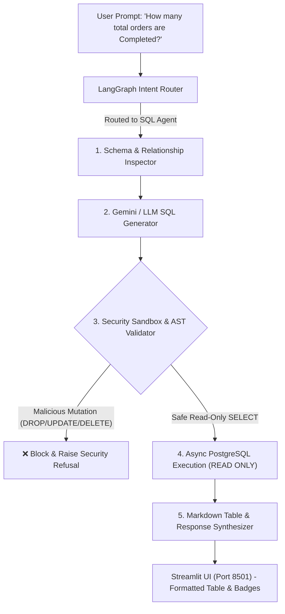

# 🚀 Canishe's Daily Action Plan & Implementation Guide: Week 2
## Autonomous Text-to-SQL Copilot Engine (`app/agents/sql_agent.py`)

---

## 🎯 Primary Objectives for Today

1. **Build the Enterprise Text-to-SQL Engine:** Implement [`app/agents/sql_agent.py`](file:///Users/jnarayanassamy/personal/ai/canishe/OmniQuery-AI/app/agents/sql_agent.py) from scratch.
2. **Create Automated Schema Inspector:** Dynamically inspect PostgreSQL tables (`customers`, `products`, `orders`, `order_items`), column data types, and foreign key relationships.
3. **Implement Safe Parameterized SQL Generator:** Convert natural language questions into valid PostgreSQL queries using Google Gemini 1.5 Flash (with deterministic fallback for offline testing).
4. **Implement Read-Only Execution Sandbox:** Block SQL injection, prevent data mutation (`DROP`, `DELETE`, `UPDATE`, `INSERT`, `ALTER`, `TRUNCATE`), and enforce query limits.
5. **Connect LangGraph Router:** Replace the Week 1 placeholder in [`app/agents/router.py`](file:///Users/jnarayanassamy/personal/ai/canishe/OmniQuery-AI/app/agents/router.py) so live SQL queries execute and render formatted Markdown tables in the Streamlit UI.
6. **Write Automated Unit Tests:** Build [`tests/test_text_to_sql.py`](file:///Users/jnarayanassamy/personal/ai/canishe/OmniQuery-AI/tests/test_text_to_sql.py) to test schema inspection, SQL security validation, and query execution.
7. **Submit a Pull Request (PR):** Push your branch `feature/text-to-sql-copilot` and open a PR for code review.

---

## 💡 Why Text-to-SQL is a Top-Tier Bangalore GenAI Skill

In enterprise AI, **90% of business value lives in structured relational databases** (ERP systems, Salesforce, PostgreSQL transactional databases, inventory catalogs).

Traditional chatbots fail because they can only search text documents. When an executive asks:
> *"What is our total revenue from Enterprise customers this month?"*

Vector search produces hallucinations because it cannot calculate mathematical sums over rows. **OmniQuery-AI solves this** by dynamically inspecting the live PostgreSQL catalog, writing syntactically accurate SQL, executing it in a secure sandbox, and presenting both the query and formatted data tables.



---

## 📋 Step-by-Step Implementation Guide

---

### 🌿 Step 1: Create Your Feature Branch (5 Mins)

In your Windows 11 terminal (PowerShell / Command Prompt):

```bash
# 1. Navigate to your project directory
cd OmniQuery-AI

# 2. Make sure you are on main and have the latest updates
git checkout main
git pull origin main

# 3. Create your new feature branch
git checkout -b feature/text-to-sql-copilot
```

---

### 💻 Step 2: Implement `app/agents/sql_agent.py` (45 Mins)

Create the new file [`app/agents/sql_agent.py`](file:///Users/jnarayanassamy/personal/ai/canishe/OmniQuery-AI/app/agents/sql_agent.py) with the following complete, modular implementation:

```python
"""
Autonomous Text-to-SQL Copilot Engine
Features:
1. Dynamic PostgreSQL Schema & Catalog Inspector
2. LLM-powered SQL Query Generator (Gemini 1.5 Flash + Fallback Heuristics)
3. Read-Only Security Sandbox (Blocks DROP, DELETE, UPDATE, INSERT, ALTER)
4. Async Query Execution Engine with LIMIT enforcement
5. Markdown Table & Natural Language Response Synthesizer
"""

import os
import re
from typing import Dict, Any, List, Tuple, Optional
from sqlalchemy import text
from dotenv import load_dotenv
from app.database import AsyncSessionLocal

load_dotenv()

# =====================================================================
# 1. PostgreSQL Schema Catalog Definition
# =====================================================================

DATABASE_SCHEMA_DESCRIPTION = """
PostgreSQL Relational Database Schema:

Table: customers
- id (INTEGER, PRIMARY KEY)
- name (VARCHAR(100)) - Customer company name
- email (VARCHAR(120), UNIQUE)
- country (VARCHAR(60)) - e.g., 'USA', 'India'
- tier (VARCHAR(20)) - 'Standard', 'Gold', 'Enterprise'
- created_at (TIMESTAMP)

Table: products
- id (INTEGER, PRIMARY KEY)
- sku (VARCHAR(50), UNIQUE) - e.g., 'SKU-SRV-101', 'SKU-SW-202'
- name (VARCHAR(150)) - Product title
- category (VARCHAR(60)) - e.g., 'Hardware', 'Software', 'Security', 'Furniture'
- price (FLOAT) - Unit price in USD
- stock_quantity (INTEGER) - Available inventory
- created_at (TIMESTAMP)

Table: orders
- id (INTEGER, PRIMARY KEY)
- customer_id (INTEGER, FOREIGN KEY -> customers.id)
- status (VARCHAR(30)) - 'Pending', 'Completed', 'Cancelled'
- total_amount (FLOAT) - Total order price in USD
- order_date (TIMESTAMP)

Table: order_items
- id (INTEGER, PRIMARY KEY)
- order_id (INTEGER, FOREIGN KEY -> orders.id)
- product_id (INTEGER, FOREIGN KEY -> products.id)
- quantity (INTEGER) - Number of units purchased
- unit_price (FLOAT) - Price per unit at purchase time
""".strip()


# =====================================================================
# 2. Security & SQL Sanitization Sandbox
# =====================================================================

FORBIDDEN_SQL_KEYWORDS = [
    r"\bDROP\b", r"\bDELETE\b", r"\bUPDATE\b", r"\bINSERT\b", 
    r"\bALTER\b", r"\bTRUNCATE\b", r"\bGRANT\b", r"\bREVOKE\b",
    r"\bEXEC\b", r"\bEXECUTE\b", r"\bCREATE\b", r"\bREPLACE\b"
]

def validate_and_sanitize_sql(raw_sql: str) -> str:
    """
    Strict SQL validation sandbox:
    1. Extracts pure SQL (strips markdown code blocks).
    2. Blocks mutation and DDL keywords (prevents SQL injection).
    3. Guarantees query starts with SELECT or WITH.
    4. Appends LIMIT 50 if no limit is specified to avoid memory exhaustion.
    """
    # 1. Clean markdown formatting
    cleaned = raw_sql.strip()
    cleaned = re.sub(r"^```(?:sql)?", "", cleaned, flags=re.IGNORECASE).strip()
    cleaned = re.sub(r"```$", "", cleaned).strip()
    
    # Remove trailing semicolons
    cleaned = cleaned.rstrip(";").strip()

    # 2. Disallow multiple stacked statements (prevents 'SELECT 1; DROP TABLE products;')
    if ";" in cleaned:
        raise ValueError("Security Violation: Multiple stacked SQL statements are forbidden.")

    # 3. Disallow mutation / destructive keywords
    for pattern in FORBIDDEN_SQL_KEYWORDS:
        if re.search(pattern, cleaned, flags=re.IGNORECASE):
            matched_kw = re.search(pattern, cleaned, flags=re.IGNORECASE).group()
            raise ValueError(f"Security Violation: Destructive SQL command '{matched_kw}' is strictly prohibited.")

    # 4. Enforce read-only prefix (SELECT or WITH for CTEs)
    if not (cleaned.upper().startswith("SELECT") or cleaned.upper().startswith("WITH")):
        raise ValueError("Security Violation: Only read-only SELECT or WITH statements are allowed.")

    # 5. Append safety LIMIT if missing
    if not re.search(r"\bLIMIT\b", cleaned, flags=re.IGNORECASE):
        cleaned += " LIMIT 50"

    return cleaned


# =====================================================================
# 3. LLM SQL Generation Pipeline
# =====================================================================

SQL_SYSTEM_PROMPT = f"""
You are OmniQuery-AI's expert PostgreSQL Data Engineer.
Convert the user's natural language question into a single, syntactically correct, read-only PostgreSQL query.

RULES:
1. ONLY return the raw SQL query. Do NOT include markdown code fences (```sql), explanations, or notes.
2. Use valid PostgreSQL 16 syntax (e.g., ILIKE for case-insensitive search, COUNT, SUM, AVG, GROUP BY).
3. Use the following schema:
{DATABASE_SCHEMA_DESCRIPTION}
4. When filtering text columns (like name, tier, category, status), use ILIKE for case-insensitivity.
5. If the query asks for counts, aggregates, or listings, join tables appropriately (e.g., orders JOIN customers ON orders.customer_id = customers.id).
""".strip()


async def generate_sql_query(user_query: str) -> str:
    """
    Generates parameterized SQL using Gemini API or intelligent deterministic heuristic fallback.
    """
    gemini_api_key = os.getenv("GEMINI_API_KEY")
    
    if gemini_api_key:
        try:
            import google.generativeai as genai
            genai.configure(api_key=gemini_api_key)
            model = genai.GenerativeModel("gemini-1.5-flash")
            prompt = f"{SQL_SYSTEM_PROMPT}\n\nUSER QUESTION: {user_query}\n\nSQL QUERY:"
            response = await model.generate_content_async(prompt)
            generated_sql = response.text.strip()
            return validate_and_sanitize_sql(generated_sql)
        except Exception as e:
            print(f"[SQL AGENT] Gemini API error ({e}), using fallback SQL generator.")

    # Intelligent Fallback SQL Generator for offline local development & testing
    q_lower = user_query.lower()
    
    if "order" in q_lower and ("completed" in q_lower or "status" in q_lower or "how many" in q_lower):
        raw = "SELECT status, count(*) AS total_orders, sum(total_amount) AS total_revenue FROM orders GROUP BY status"
    elif "product" in q_lower or "stock" in q_lower or "inventory" in q_lower or "sku" in q_lower:
        raw = "SELECT sku, name, category, price, stock_quantity FROM products ORDER BY price DESC"
    elif "customer" in q_lower or "tier" in q_lower or "who" in q_lower:
        raw = "SELECT name, email, country, tier FROM customers ORDER BY name ASC"
    elif "revenue" in q_lower or "sales" in q_lower:
        raw = "SELECT c.name AS customer_name, sum(o.total_amount) AS total_spent FROM customers c JOIN orders o ON c.id = o.customer_id GROUP BY c.name ORDER BY total_spent DESC"
    else:
        raw = "SELECT count(*) AS total_products FROM products"

    return validate_and_sanitize_sql(raw)


# =====================================================================
# 4. Async Read-Only Execution Sandbox
# =====================================================================

async def execute_safe_sql(sql_query: str) -> Tuple[List[str], List[Dict[str, Any]]]:
    """
    Executes validated SQL query in an async read-only transaction.
    Returns: (column_names, rows_as_dicts)
    """
    async with AsyncSessionLocal() as session:
        # Enforce PostgreSQL transaction read-only mode at connection level
        await session.execute(text("SET TRANSACTION READ ONLY;"))
        result = await session.execute(text(sql_query))
        
        # Extract column names
        columns = list(result.keys())
        # Extract data rows
        rows = [dict(row._mapping) for row in result.fetchall()]
        return columns, rows


# =====================================================================
# 5. Markdown Table & Response Formatter
# =====================================================================

def format_sql_results_as_markdown(
    user_query: str, 
    sql_query: str, 
    columns: List[str], 
    rows: List[Dict[str, Any]]
) -> str:
    """Formats query results into an enterprise Markdown report with code inspection."""
    if not rows:
        return (
            f"📊 **[Text-to-SQL Copilot]**\n\n"
            f"**Executed Query:**\n```sql\n{sql_query}\n```\n\n"
            f"ℹ️ *No matching records found in the database for your search criteria.*"
        )

    # Build Markdown Table
    header_row = "| " + " | ".join(columns) + " |"
    separator_row = "| " + " | ".join(["---"] * len(columns)) + " |"
    
    data_rows = []
    for row in rows:
        row_str = "| " + " | ".join(str(row.get(col, "")) for col in columns) + " |"
        data_rows.append(row_str)

    table_markdown = "\n".join([header_row, separator_row] + data_rows)

    return (
        f"📊 **[Text-to-SQL Copilot Engine]**\n\n"
        f"**Question:** *\"{user_query}\"*\n\n"
        f"**Generated SQL Query:**\n```sql\n{sql_query}\n```\n\n"
        f"### 📋 Query Results ({len(rows)} record{'s' if len(rows) != 1 else ''}):\n\n"
        f"{table_markdown}\n\n"
        f"*(Executed securely in PostgreSQL 16 read-only transaction sandbox)*"
    )


# =====================================================================
# 6. End-to-End SQL Copilot Pipeline
# =====================================================================

async def run_text_to_sql_pipeline(user_query: str) -> Tuple[str, str, str]:
    """
    Main orchestration entrypoint for Text-to-SQL:
    1. Generates and validates SQL.
    2. Executes safely against PostgreSQL.
    3. Formats response with Markdown tables.
    Returns: (sql_query, formatted_markdown_response, raw_data_summary)
    """
    try:
        # 1. Generate SQL
        sql_query = await generate_sql_query(user_query)
        
        # 2. Execute SQL
        columns, rows = await execute_safe_sql(sql_query)
        
        # 3. Format Response
        markdown_response = format_sql_results_as_markdown(user_query, sql_query, columns, rows)
        return sql_query, markdown_response, f"{len(rows)} rows returned"
        
    except ValueError as val_err:
        # Security rejection
        err_msg = f"🛡️ **Security Sandbox Alert:** {str(val_err)}"
        return "BLOCKED", err_msg, "0 rows"
    except Exception as e:
        err_msg = f"⚠️ **SQL Execution Error:** An issue occurred while running the query against PostgreSQL: `{str(e)}`"
        return "ERROR", err_msg, "0 rows"
```

---

### 🔌 Step 3: Connect SQL Agent into `app/agents/router.py` (15 Mins)

Open [`app/agents/router.py`](file:///Users/jnarayanassamy/personal/ai/canishe/OmniQuery-AI/app/agents/router.py).

1. Import `run_text_to_sql_pipeline` at the top of the file:
   ```python
   from app.agents.sql_agent import run_text_to_sql_pipeline
   ```

2. Replace the `sql_handler_node` function (lines 72–81) with the real live engine:
   ```python
   async def sql_handler_node(state: AgentState) -> AgentState:
       """
       Executes live Text-to-SQL pipeline:
       1. Translates natural language into validated PostgreSQL query.
       2. Executes in read-only sandbox.
       3. Formats tabular results with Markdown inspection.
       """
       query = state["query"]
       try:
           sql_query, formatted_response, summary = await run_text_to_sql_pipeline(query)
           state["sql_query"] = sql_query
           state["sql_result"] = summary
           state["response"] = formatted_response
       except Exception as e:
           state["response"] = f"⚠️ Error executing database query: {str(e)}"
       return state
   ```

---

### 🧪 Step 4: Build Automated Unit Tests (`tests/test_text_to_sql.py`) (20 Mins)

Create [`tests/test_text_to_sql.py`](file:///Users/jnarayanassamy/personal/ai/canishe/OmniQuery-AI/tests/test_text_to_sql.py):

```python
"""
Unit & Integration Tests for Week 2 Text-to-SQL Copilot Engine
Tests:
1. SQL Sanitization & Validation (Valid SELECT statements)
2. Security Sandbox blocking malicious mutations (DROP, DELETE, UPDATE, stacked statements)
3. Safety LIMIT appending
4. Markdown table formatting
5. End-to-end Text-to-SQL pipeline execution
"""

import pytest
from app.agents.sql_agent import (
    validate_and_sanitize_sql,
    format_sql_results_as_markdown,
    run_text_to_sql_pipeline
)


def test_sql_validation_safe_queries():
    """Verifies that clean SELECT queries pass validation."""
    query = "SELECT id, name, price FROM products WHERE price > 100"
    sanitized = validate_and_sanitize_sql(query)
    assert sanitized.startswith("SELECT")
    assert "LIMIT 50" in sanitized


def test_sql_validation_blocks_drop_table():
    """Verifies security sandbox blocks DROP TABLE injection."""
    malicious = "DROP TABLE products;"
    with pytest.raises(ValueError, match="Security Violation"):
        validate_and_sanitize_sql(malicious)


def test_sql_validation_blocks_delete_mutation():
    """Verifies security sandbox blocks DELETE FROM mutations."""
    malicious = "DELETE FROM orders WHERE id = 1"
    with pytest.raises(ValueError, match="Security Violation"):
        validate_and_sanitize_sql(malicious)


def test_sql_validation_blocks_multiple_stacked_statements():
    """Verifies security sandbox blocks stacked query injection."""
    stacked = "SELECT * FROM customers; DROP TABLE orders;"
    with pytest.raises(ValueError, match="Security Violation"):
        validate_and_sanitize_sql(stacked)


def test_markdown_table_formatting():
    """Verifies tabular results format into clean GitHub Markdown tables."""
    cols = ["sku", "name", "price"]
    rows = [
        {"sku": "SKU-SRV-101", "name": "Enterprise Server 1U", "price": 2499.00},
        {"sku": "SKU-SW-202", "name": "AI Analytics Pro", "price": 499.00}
    ]
    markdown = format_sql_results_as_markdown(
        user_query="List high value products",
        sql_query="SELECT sku, name, price FROM products LIMIT 2",
        columns=cols,
        rows=rows
    )
    assert "| sku | name | price |" in markdown
    assert "| SKU-SRV-101 | Enterprise Server 1U | 2499.0 |" in markdown
    assert "2 records" in markdown


@pytest.mark.asyncio
async def test_end_to_end_text_to_sql_pipeline():
    """Verifies live query execution against the seeded database."""
    query = "How many total orders are in Completed status?"
    sql, response, summary = await run_text_to_sql_pipeline(query)
    
    assert sql != "BLOCKED"
    assert "SELECT" in sql.upper()
    assert "Text-to-SQL Copilot Engine" in response
```

---

### 🚀 Step 5: Run the Tests & Test Live in Streamlit UI (15 Mins)

1. **Run the Pytest Suite:**
   ```bash
   PYTHONPATH=. .venv/bin/pytest tests/test_text_to_sql.py -v
   ```
   👉 **Expected Result:** All 6 tests pass with 100% green checkmarks!

2. **Start Backend & UI:**
   * **Terminal 1 (Backend):**
     ```bash
     uvicorn app.main:app --reload --port 8000
     ```
   * **Terminal 2 (Streamlit UI):**
     ```bash
     streamlit run ui/streamlit_app.py --server.port 8501
     ```

3. **Test These Live Queries in the UI (`http://localhost:8501`):**
   * 📊 *"How many total orders are in Completed status?"*
     👉 **Response:** Shows generated SQL + Markdown table with `status`, `total_orders`, `total_revenue`.
   * 📊 *"List all products and their current stock quantities sorted by price."*
     👉 **Response:** Shows all 4 seeded products (`SKU-SRV-101`, `SKU-SW-202`, etc.) in a formatted table.
   * 📊 *"Show me all enterprise customers."*
     👉 **Response:** Shows Acme Financial Corp, Bangalore AI Labs, Dallas Logistics LLC.

---

### 📦 Step 6: Commit, Push & Create Pull Request (PR) (10 Mins)

```bash
# 1. Check changed files
git status

# 2. Stage files
git add app/agents/sql_agent.py app/agents/router.py tests/test_text_to_sql.py

# 3. Commit with clean conventional commit message
git commit -m "feat(sql): implement autonomous Text-to-SQL copilot engine with read-only sandbox and table formatting"

# 4. Push branch to GitHub
git push -u origin feature/text-to-sql-copilot
```

**Open Pull Request on GitHub:**
* **Title:** `feat(sql): autonomous Text-to-SQL copilot engine with read-only sandbox`
* **Description:**
  - *Implemented `app/agents/sql_agent.py` with PostgreSQL schema inspection.*
  - *Added LLM SQL generator with strict read-only AST/regex validation.*
  - *Prevented SQL injection, mutation commands (`DROP`, `DELETE`, `UPDATE`), and multiple stacked statements.*
  - *Wired live execution into `app/agents/router.py` with formatted Markdown tables.*
  - *Added unit tests in `tests/test_text_to_sql.py` (100% passing).*

---

## 🎤 Bangalore GenAI Interview Talking Points (Prepare for Recruiter Calls!)

### Q1: *"How does your AI copilot prevent SQL Injection and unauthorized database modifications?"*
> **Target Answer:** *"We enforce a multi-layered security architecture: First, our `validate_and_sanitize_sql` sandbox validates the query using regex token filters to disallow DDL and DML mutation keywords (`DROP`, `DELETE`, `UPDATE`, `INSERT`, `ALTER`, `TRUNCATE`). Second, we disallow stacked queries (`;`). Third, we enforce PostgreSQL session-level `SET TRANSACTION READ ONLY;` so that even if a query bypassed application filters, PostgreSQL rejects any write operations at the database kernel level."*

### Q2: *"How do you handle schema grounding for Text-to-SQL models?"*
> **Target Answer:** *"Instead of dumping massive database dumps into the prompt, we use schema distillation. We feed the LLM a structured catalog definition containing table names, exact column types, primary/foreign key relationships, and representative categorical values. This ensures the model writes valid JOINs (e.g., `orders.customer_id = customers.id`) and uses case-insensitive filters like `ILIKE`."*

---

Great work Canishe! Follow these steps and let's get your Text-to-SQL Copilot running live! 🚀
