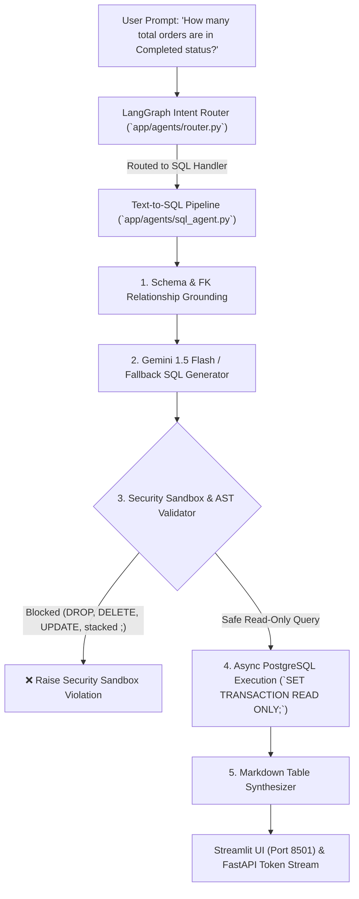

# 🎓 Canishe's Week 2 Retrospective & Antigravity (AGY) Mastery Guide
## Milestone 2 Review, Code Deep-Dive, Communication Analysis & Agent Efficiency Playbook

---

## 📌 Executive Summary

On **September 2, 2026** (05:27 AM – 07:20 AM IST / late evening Dallas time), Canishe executed the implementation for **Week 2: Autonomous Text-to-SQL Copilot Engine** ([`CANISHE_ACTION_PLAN_WEEK_2_TEXT_TO_SQL_COPILOT.md`](file:///Users/jnarayanassamy/personal/ai/canishe/OmniQuery-AI/CANISHE_ACTION_PLAN_WEEK_2_TEXT_TO_SQL_COPILOT.md)).

### 🎯 Scorecard & Key Deliverables
* **Feature Branch:** `feature/text-to-sql-copilot`
* **Commit:** `e3afdb45e9f56fd8fbd350c8041ac8dfe8610709` (`feat(sql): implement autonomous Text-to-SQL copilot engine with read-only sandbox and table formatting`)
* **Test Suite Status:** **10/10 PASSED (100%) in 31.01s** (4 Hybrid RAG tests + 6 Text-to-SQL unit & integration tests).
* **PR Created:** Ready for code review and merge into `main` at: `https://github.com/ccanishe/OmniQuery-AI/pull/new/feature/text-to-sql-copilot`.
* **Knowledge Transfer:** Completed an extensive code walkthrough, AST security analysis, and a 4-question Bangalore GenAI interview preparation playbook.

---

## 🏗️ What Was Built: Architecture & Code Deep Dive

In enterprise GenAI, **over 90% of operational business data lives in relational database tables** (orders, inventory, ERP ledgers). Vector embeddings cannot perform arithmetic aggregations (`SUM`, `COUNT`, `AVG`) or foreign-key joins. Canishe’s Week 2 implementation bridges this gap with an autonomous Text-to-SQL copilot engine.



### Key Modules Implemented:

1. **Schema Catalog & Grounding ([`app/agents/sql_agent.py`](file:///Users/jnarayanassamy/personal/ai/canishe/OmniQuery-AI/app/agents/sql_agent.py)):**
   * Supplies exact table definitions for `customers`, `products` (SKUs, stock, pricing), `orders` (status, totals), and `order_items` (quantities, foreign keys).
   * Prevents hallucinated table and column names by grounding the LLM prompt with strict relational schema context.

2. **Defense-in-Depth Security Sandbox (`validate_and_sanitize_sql`):**
   * **Markdown Stripping:** Cleans markdown code fences (` ```sql `).
   * **Mutation Keyword Blocking:** Blocks DDL/DML mutation keywords (`DROP`, `DELETE`, `UPDATE`, `INSERT`, `ALTER`, `TRUNCATE`, `EXEC`, `CREATE`).
   * **Stacked Statement Defense:** Disallows semicolons (`;`) to block multi-query injection attacks.
   * **Read-Only Enforcement:** Enforces queries to begin strictly with `SELECT` or `WITH`.
   * **Auto Row Limiting:** Enforces safety `LIMIT 50` if no `LIMIT` clause was generated.

3. **Read-Only Transaction Isolation (`execute_safe_sql`):**
   * Even if a clever injection bypassed prompt guards, queries execute inside an explicit PostgreSQL session configured with `SET TRANSACTION READ ONLY;`.
   * The database engine itself rejects any write attempts at the kernel level.

4. **Tabular Markdown Synthesizer (`format_sql_results_as_markdown`):**
   * Converts raw SQLAlchemy row tuples into clean GitHub-flavored Markdown tables.
   * Appends a collapsible SQL code block for auditing and explainability.

5. **LangGraph Router Integration ([`app/agents/router.py`](file:///Users/jnarayanassamy/personal/ai/canishe/OmniQuery-AI/app/agents/router.py)):**
   * Replaced the Week 1 placeholder in `sql_handler_node` to execute the full pipeline asynchronously and pass the formatted table directly to the Streamlit UI.

---

## 🔍 Transcript Analysis: How Canishe Communicated with Antigravity

Canishe's raw conversation transcript (`OmniQuery_AI_Week_2_Text_to_SQL_Copilot_Transcript.txt`) reveals key patterns in his prompt engineering and workflow execution.

### The Prompts Canishe Issued:
| Step # | Timestamp (IST) | User Prompt Content | Key Observation |
| :---: | :---: | :--- | :--- |
| **0** | 05:27:54 AM | *"I am in meetup with me uncle now for omni query ai. I am working on action plan week 2 text to sql copilot.C:\Users\DELL\Personal\Projects\OmniQuery-AI\CANISHE_ACTION_PLAN_WEEK_2_TEXT_TO_SQL_COPILOT.md. We have work this now"* | Single prompt triggering 153 autonomous steps. Grammatically rough, but attached the action plan. |
| **154** | 06:48:05 AM | *"i want you to help me what happened in the project on executing this task 'text to sql copilot md file'. I want you to explain until where was our project before this task. I want you to teach me what we did in this task to acheive the goal. Explain how it connects by walk me through of the code. also cover the interview questions and answers. the goal is learn and understand what is happening in this task."* | **Exceptional self-awareness.** Recognized the need to master the concepts for job interviews. |
| **156** | 07:07:38 AM | *"update your md file with necessary information from this chat"* | Underspecified target file. AGY guessed `CANISHE_ACTION_PLAN_WEEK_2...md` instead of `GEMINI.md`. |
| **163** | 07:10:15 AM | *"i want you to update your gemini.md file from the chats we had so for, so that you gain context of this project, and our sync in learning process"* | Clarified the target file to persist context into `GEMINI.md` and `AGENTS.md`. |
| **171** | 07:20:35 AM | *"Export the entire exact raw conversation transcript from this current chat session into a plain text (.txt) file in the current working directory. Use the title/name of this chat session as the filename..."* | Highly specific instruction that generated the transcript file for Uncle Janar. |

---

## 💡 Opportunities for Canishe to Improve Efficiency with Antigravity

While the end result was a 100% technical success, there are **5 critical habits** Canishe can develop to transition from a student relying on AI to an **Elite AI Engineer (Track C ₹10–16 LPA)** directing an AI co-pilot:

### 1. Shift from "Monolithic Delegation" to "Iterative Micro-Sprints"
* **Current Pattern:** Canishe gave one prompt at Step 0, and AGY executed 153 steps uninterrupted over 80 minutes.
* **The Risk:** 
  * In a production engineering environment, unsupervised agent runs can drift, select suboptimal packages, or introduce architectural debt.
  * Canishe became a passive bystander during the construction of the system, which is why he had to ask *"what did we just do?"* at Step 154.
* **The Fix: 30-Minute Micro-Sprints:**
  * **Sprint 1 (Infrastructure & Schema):** *"Verify Docker and inspect the PostgreSQL schema. Confirm all 4 tables exist before writing any agent code."*
  * **Sprint 2 (Security Sandbox):** *"Implement `validate_and_sanitize_sql` first. Let's run 3 malicious test queries against it to prove it catches injection before we touch the LLM."*
  * **Sprint 3 (Pipeline & LangGraph):** *"Now wire the LLM generator and connect it to LangGraph."*
  * **Benefit:** Canishe learns and owns the code incrementally, eliminating post-task confusion.

### 2. Practice the "TRAC" Prompting Framework
Prompt engineering is a primary technical competency evaluated in GenAI interviews. Avoid shorthand phrases like *"We have work this now"* or *"update your md file"*. Use **TRAC**:
* **T - Target:** Exact file path (`personal/GEMINI.md`, `app/agents/sql_agent.py`)
* **R - Role:** Persona for AGY (*"Act as a Principal Database & GenAI Architect"*)
* **A - Action:** Specific operational verb (*"Refactor", "Implement", "Benchmark", "Audit"*)
* **C - Constraints:** Boundaries (*"Ensure read-only enforcement, include type hints, keep under 50 lines"*)

> **Example Before:**
> *"update your md file with necessary information from this chat"*
>
> **Example After (TRAC):**
> *"Update `personal/GEMINI.md` under Mentorship & Active Projects. Record that Milestone 2 (Text-to-SQL) is 100% complete with 10/10 passing tests, and document the 4 interview questions we reviewed."*

### 3. Utilize Antigravity Slash Commands (`/plan`, `/grill-me`, `/learn`)
Canishe used zero slash commands during the session. Mastering these tools elevates pair-programming efficiency:
* **`/plan`:** Type `/plan <feature>` before coding. AGY produces a structured step-by-step architectural blueprint with review checkpoints.
* **`/grill-me`:** Instead of passively reading explanations, run `/grill-me on app/agents/sql_agent.py`. AGY will conduct an interactive technical mock interview, asking challenging questions about AST parsing, SQL injection vectors, and transaction isolation.
* **`/learn`:** When a tricky system error is solved (such as Windows PowerShell UTF-8 encoding or virtual environment execution), typing `/learn` instructs AGY to permanently remember the resolution for future sessions.

### 4. Active Socratic Learning vs. Passive Reading
At Step 154, Canishe had the right instinct to ask for an explanation. To maximize retention for interviews, turn AGY into a technical challenger:
* *"Give me 2 SQL injection attack payloads that might bypass simple string replacement. Let's see if our AST regex sandbox catches them."*
* *"Interview me: ask me why we chose `SET TRANSACTION READ ONLY` instead of creating a dedicated read-only Postgres user. Grade my answer."*

### 5. Automated Transcript & Diagnostic Tooling
In Step 171, AGY spent 12+ tool cycles writing ad-hoc Python scripts to search internal brain directories for transcript files.
* **Solution:** OmniQuery-AI now includes [`scripts/export_transcript.py`](file:///Users/jnarayanassamy/personal/ai/canishe/OmniQuery-AI/scripts/export_transcript.py), which can export clean session logs in a single second.

---

## 🎤 Bangalore GenAI Interview Playbook (Track C: ₹10–16 LPA Focus)

These 4 questions are standard in senior GenAI engineering interviews across Bangalore (TCS AI Labs, Infosys Topaz, Swiggy, Flipkart, and tier-1 startups). Canishe should practice these answers aloud:

### Q1: *"Why use Text-to-SQL instead of feeding database records into a Vector Database (RAG)?"*
> **Candidate Answer:**
> *"Vector embeddings represent semantic similarity, not mathematical or relational logic. If an executive asks: 'What is our total revenue from enterprise clients this quarter?', a Vector DB retrieves sample chunks of text but cannot compute an exact arithmetic `SUM()` or perform a foreign-key join between `customers` and `orders`. Text-to-SQL dynamically writes deterministic SQL, offloads the mathematical computation to the database engine, and formats the exact result, eliminating aggregation hallucinations."*

### Q2: *"How do you prevent SQL Injection and unauthorized database mutations in your LLM agent?"*
> **Candidate Answer:**
> *"We implement defense-in-depth across three distinct layers:*
> *1. **Schema-Constrained Prompting:** The LLM only receives read-only schema definitions and few-shot examples of `SELECT` queries.*
> *2. **Security Sandbox & AST Validation:** Before execution, our `validate_and_sanitize_sql` function strips markdown fences, blocks mutation keywords (`DROP`, `DELETE`, `UPDATE`, `INSERT`, `ALTER`), disallows stacked statements (semicolons `;`), enforces `SELECT`/`WITH` query starts, and appends a mandatory `LIMIT 50`.*
> *3. **Database-Level Read-Only Transaction:** Even if an adversarial prompt engineered a query past our regex, the database session explicitly executes `SET TRANSACTION READ ONLY;`. Any attempt to write or alter data is rejected at the PostgreSQL kernel level."*

### Q3: *"How do you handle schema grounding at enterprise scale without blowing up prompt context windows?"*
> **Candidate Answer:**
> *"In enterprise environments with hundreds of tables, injecting the entire DDL into the prompt is wasteful and leads to context rot. We use dynamic schema pruning: we embed table and column descriptions in a vector index. When the user asks a question, we first retrieve the top 3–5 relevant tables via semantic similarity, prune foreign keys that are irrelevant to the query, and inject only the pruned schema subgraph into the LLM context."*

### Q4: *"How does LangGraph coordinate routing between Document RAG and Text-to-SQL?"*
> **Candidate Answer:**
> *"Our LangGraph state machine uses an autonomous intent classification node. The router inspects the semantic intent of the query: if the user asks for policy, architectural definitions, or unstructured context, it routes to our Hybrid RAG pipeline (Dense + BM25 + Reciprocal Rank Fusion + FlashRank). If the query involves metrics, aggregations, inventory, or transactional records, it routes to our Text-to-SQL agent. If the query is ambiguous, a fallback node asks clarifying questions."*

---

## 📋 Canishe's Week 3 Preparation Checklist

- [ ] **PR Review & Merge:** Check out `feature/text-to-sql-copilot`, review the PR on GitHub, and merge into `main`.
- [ ] **Practice the 4 Interview Questions:** Practice answering them aloud without looking at notes.
- [ ] **Adopt the TRAC Prompting Framework:** Use structured prompts with explicit file paths for all future AGY requests.
- [ ] **Use `/plan` for Milestone 3:** Start the next feature using `/plan` mode to review the architectural roadmap interactively with Uncle Janar.
- [ ] **Run Transcript Exporter:** Use `python scripts/export_transcript.py` at the end of each session to keep an archive of pair-programming learnings.
