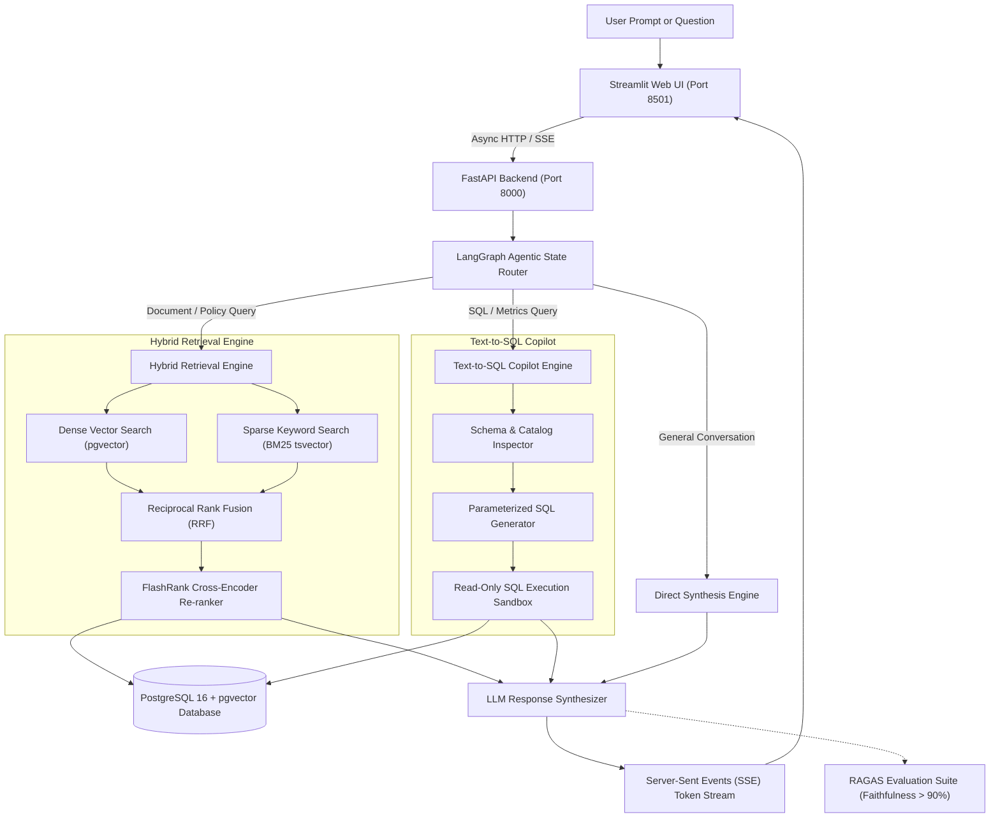
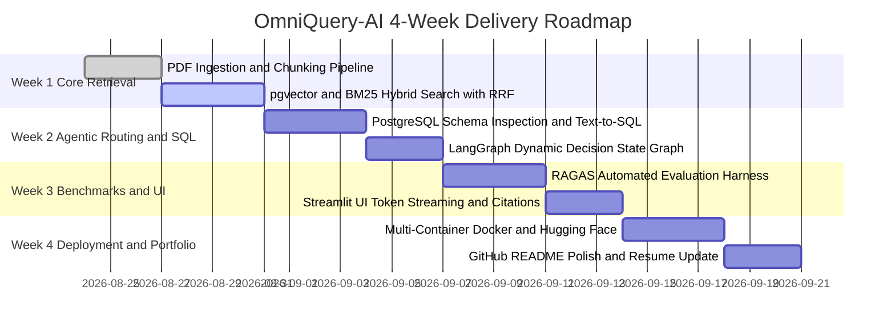

# OmniQuery-AI: Project Overview, Requirements & Architecture Specification

---

## 1. Executive Summary & Vision

**OmniQuery-AI** is a production-grade enterprise AI copilot and applied GenAI microservice. It unites unstructured document knowledge retrieval (PDFs, policies, technical manuals) with structured relational database intelligence (PostgreSQL tables, metrics, transactions) under a single agentic orchestrator.

### The Problem It Solves
Traditional enterprise AI deployments struggle with two major limitations:
1. **Naive Vector Search Limitations:** Pure vector similarity search often misses exact alphanumeric identifiers, SKUs, error codes, and specific terminology, while also suffering from context dilution and hallucinations.
2. **Data Silos (Unstructured vs. Structured):** Standard chatbots cannot query live operational databases, forcing enterprises to run separate disconnected tools for document search and SQL reporting.

**OmniQuery-AI bridges this gap** by combining:
* **Hybrid Search (Dense pgvector + Sparse BM25)** with **Reciprocal Rank Fusion (RRF)**.
* **Autonomous Text-to-SQL Copilot** with schema validation and read-only execution sandboxing.
* **LangGraph Agentic State Machine** for dynamic query classification and routing.
* **Automated RAGAS Quality Benchmarking** ensuring **> 90% Faithfulness** and zero hallucinations.

---

## 2. Project Goals & Mentorship Context

### Target Outcomes:
* **For Canishe (Junior GenAI / LLM Application Engineer — Bangalore Market):**
  * Target Compensation: **₹10–16 LPA** at top Bangalore AI startups and product enterprises (Sarvam AI, Yellow.ai, Krutrim, Fractal, Quantiphi, Tiger Analytics, Bosch, Cisco).
  * Proof-of-Work Package: A public GitHub repository with automated tests, architecture diagrams, quantitative RAGAS benchmarks, and a 1-click live web demo on Hugging Face Spaces.
* **For Janar (Director of AI Architecture — Dallas Market):**
  * Demonstrates hands-on design of high-throughput asynchronous microservices, vector database scaling, LangGraph state machines, and automated LLM evaluation harnesses.

---

## 3. System Architecture Diagram

---

## 4. Functional Requirements

| Capability | Requirement Description | Acceptance Criteria |
| :--- | :--- | :--- |
| **FR-1: PDF Ingestion Pipeline** | Ingest multi-page PDFs, chunk text using `RecursiveCharacterTextSplitter` (chunk size: 500, overlap: 50), generate 384-d embeddings. | Chunks stored in PostgreSQL with both `vector(384)` and `tsvector` columns populated. |
| **FR-2: Hybrid Retrieval (Dense + Sparse)** | Query PostgreSQL using dense cosine distance (`pgvector`) in parallel with full-text search (`ts_rank_cd` over `tsvector`). | Retrieve top $2k$ candidates from each search and merge using Reciprocal Rank Fusion ($k=60$). |
| **FR-3: Cross-Encoder Re-ranking** | Apply FlashRank or Cross-Encoder re-ranking to the top fused candidates to compress context. | Context window contains only top high-relevance chunks before LLM prompt injection. |
| **FR-4: Text-to-SQL Engine** | Convert natural language into SQL, validate table and column existence against database schema, and execute in read-only mode. | Prevent SQL injection, block `DROP`/`DELETE`/`UPDATE` mutations, and return formatted Markdown tables. |
| **FR-5: LangGraph Agent Router** | Dynamically inspect incoming query intent using a LangGraph state graph. | Automatically route to `rag`, `sql`, or `direct` nodes without manual user switching. |
| **FR-6: Asynchronous Token Streaming** | Support real-time token delivery via Server-Sent Events (SSE). | Low First-Token Latency (< 500ms) displayed word-by-word on the client. |
| **FR-7: Automated RAGAS Quality Suite** | Run automated evaluation test harness against ground-truth question-answer pairs. | **Faithfulness > 0.90**, **Answer Relevance > 0.85**, **Context Precision > 0.80**. |
| **FR-8: Streamlit Interactive UI** | Web interface featuring chat history, routing badges, SQL query inspection, and latency metrics. | Seamless interaction on port `8501`. |

---

## 5. Technical Stack & Environment Requirements

### Core Technologies
* **Language & Runtime:** Python 3.11+
* **API Framework:** FastAPI (Async REST + SSE streaming) with Uvicorn
* **Database:** PostgreSQL 16 with `pgvector` and `pg_trgm` extensions
* **Database Driver / ORM:** SQLAlchemy 2.0 (AsyncIO) + `asyncpg`
* **Agentic Orchestration:** LangGraph & LangChain Core
* **Embedding Model:** `sentence-transformers/all-MiniLM-L6-v2` (384-dimensional, local) or Gemini Embeddings
* **LLM Providers:** Google Gemini API (Free tier) or Local Ollama (`llama3:latest` / `qwen2.5:latest`)
* **Evaluation Framework:** RAGAS + Pytest
* **User Interface:** Streamlit

### Hardware & Collaboration Requirements
* **Mentor (Dallas / CDT):** MacBook with VS Code, Live Share, Docker Desktop.
* **Mentee (India / IST):** Windows 11 with VS Code, Live Share, Docker Desktop (WSL2), Python 3.11+.
* **Pair Programming:** Real-time collaboration over Google Meet using **VS Code Live Share** (shared editor, shared terminal, and port forwarding for `8000` & `8501`).

---

## 6. 4-Week Milestone Roadmap

### Detailed Milestone Breakdown:

#### Week 1: Core Hybrid Retrieval Engine
* [ ] Implement `app/rag/ingest.py`: PDF document loading, text splitting, embedding generation.
* [ ] Initialize database table `document_chunks` with `vector(384)` and PostgreSQL `tsvector` index.
* [ ] Implement Reciprocal Rank Fusion (RRF) and FlashRank re-ranking in `app/rag/hybrid_retriever.py`.
* [ ] Connect live retrieval to LLM response synthesizer.

#### Week 2: Agentic Routing & Text-to-SQL Copilot
* [ ] Implement `app/agents/sql_agent.py`: Safe schema discovery, prompt engineering for SQL generation, read-only query execution.
* [ ] Upgrade `app/agents/router.py`: Build multi-node LangGraph state machine routing between Document RAG, SQL Agent, and Direct LLM.
* [ ] Add error fallback handlers when SQL queries fail or documents are out-of-domain.

#### Week 3: Quality Benchmarking (RAGAS) & UI Polish
* [ ] Implement `app/eval/ragas_bench.py`: Create ground-truth dataset (20 test cases).
* [ ] Calculate Faithfulness, Answer Relevance, and Context Precision metrics automatically.
* [ ] Connect FastAPI Server-Sent Events (`/api/v1/stream`) to Streamlit chat interface.

#### Week 4: Cloud Deployment & Portfolio Showcase
* [ ] Build multi-stage `Dockerfile` and update `docker-compose.yml`.
* [ ] Deploy 1-click live demo on Hugging Face Spaces.
* [ ] Finalize GitHub README with architecture diagrams, API docs, and RAGAS benchmark scorecards.
* [ ] Update Canishe's resume with high-impact, ATS-optimized bullet points.

---

## 7. Recruiter Proof-of-Work Package

Upon completion of this project, Canishe will present:
1. **Public GitHub Repository:** Clean modular code, async FastAPI design, LangGraph state machine, typed Python, and automated Pytest suites.
2. **1-Click Live Hosted Demo:** Publicly accessible demo link on Hugging Face Spaces.
3. **RAGAS Benchmark Scorecard:** Measurable evidence of system reliability (> 90% Faithfulness).
4. **Resume Bullet Points:** Tailored for Bangalore GenAI job listings highlighting Hybrid Search, RRF, and LangGraph orchestration.
