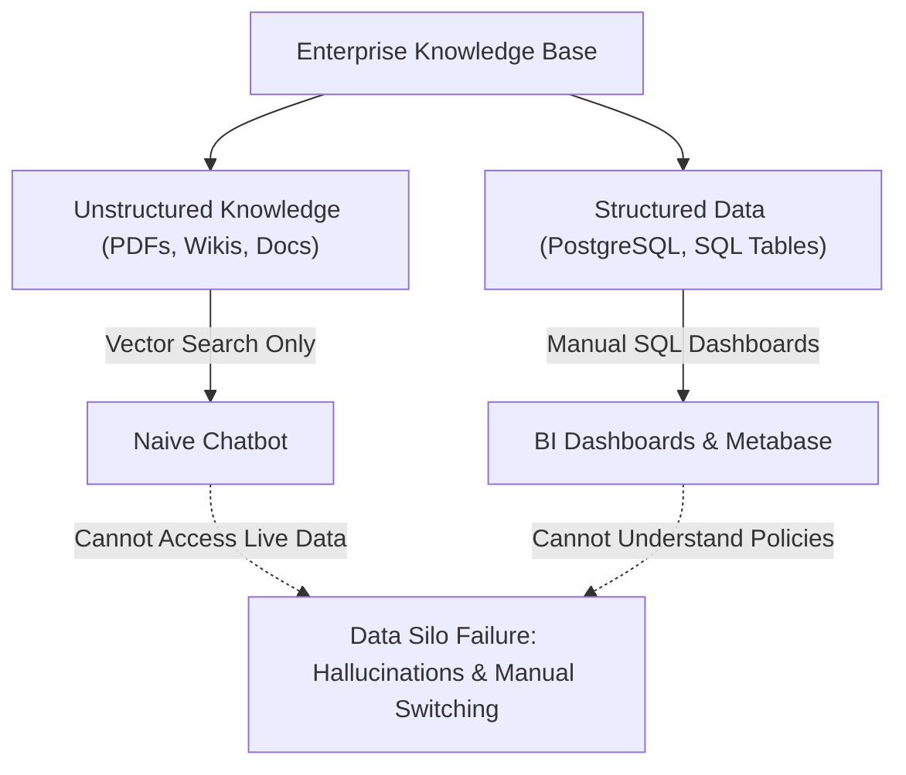
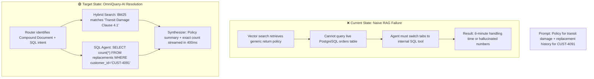
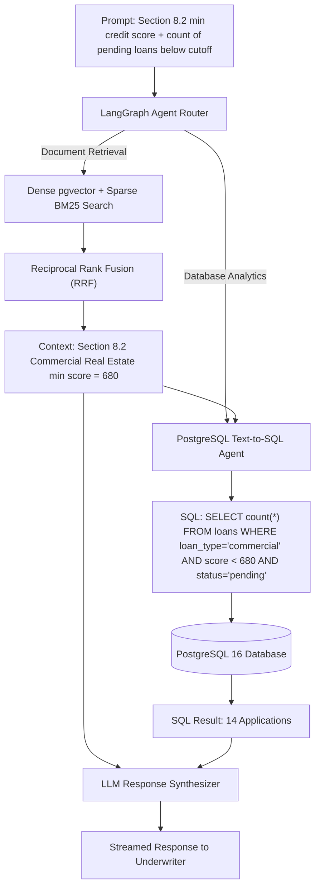
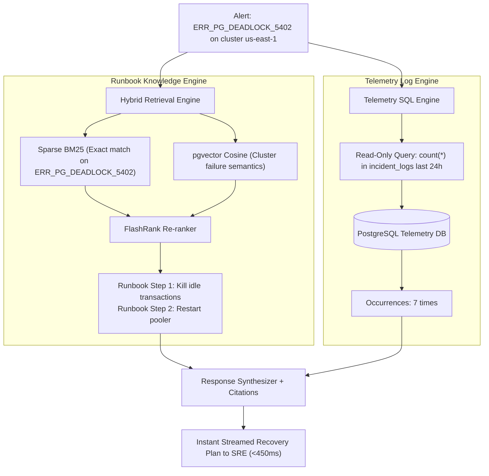
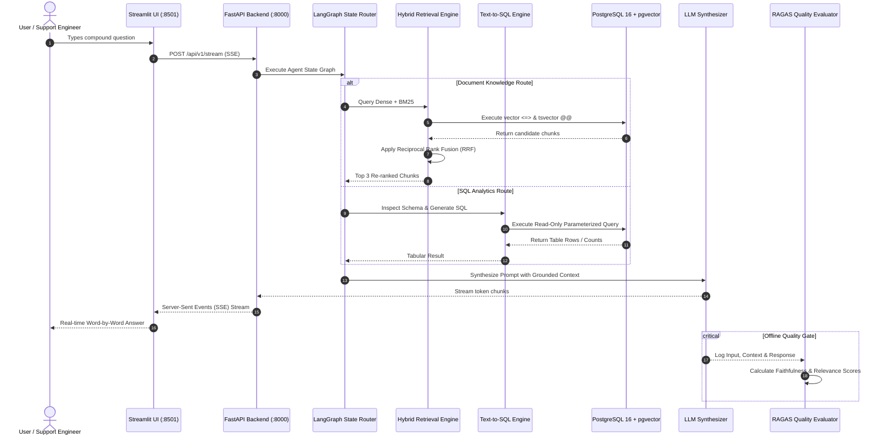

# OmniQuery-AI: Real-World Enterprise Use Cases & Target State Architecture

---

## 1. Executive Problem Statement: The Enterprise Data Divide

In modern enterprises, mission-critical knowledge is fundamentally split into two disjointed silos:

1. **Unstructured Knowledge (Text & Documents):** PDF operational policies, engineering runbooks, compliance guidelines, vendor contracts, and HR handbooks.
2. **Structured Relational Data (Databases & Tables):** PostgreSQL transactional records, user profiles, order logs, financial ledgers, and telemetry.



### Why Naive AI Chatbots Fail in Production:
* **The Alphanumeric Blur:** Dense vector embeddings convert strings to float coordinates. Exact identifiers like error codes (`ERR_DB_LOCK_804`), customer IDs (`CUST-4091`), or policy sections (`Clause 8.2`) get blurred with generic terms.
* **Mathematical Incompetence:** Large language models cannot perform mental aggregations (summing revenue, counting records, computing averages) across document text without hallucinating.
* **Lack of Multi-Agent Routing:** Users must manually select between a document search tool and a SQL query tool.

---

## 2. Capability Comparison: Current State vs. Target State

| Dimension | Current State (Naive RAG / Basic Chatbots) | Target State (OmniQuery-AI) |
| :--- | :--- | :--- |
| **Exact Keyword Matching** | ❌ **Fails:** Converts IDs, error codes, and SKUs to generic floats. | 🟢 **Succeeds:** Sparse BM25 (`tsvector`) grabs exact alphanumeric matches, merged with dense vectors via RRF. |
| **Database Aggregations** | ❌ **Fails:** Hallucinates counts, sums, and averages from memory. | 🟢 **Succeeds:** Parameterized Text-to-SQL queries PostgreSQL directly with 100% mathematical precision. |
| **Compound Queries** | ❌ **Siloed:** Requires two separate screens (Confluence wiki + Metabase dashboard). | 🟢 **Unified:** LangGraph dynamically routes sub-questions to documents and SQL in a single interaction. |
| **Quality Verification** | ❌ **None:** No automated mechanism to detect hallucinations before user delivery. | 🟢 **Benchmarked:** Automated RAGAS testing pipeline scoring **Faithfulness > 90%**. |
| **Response Latency** | ❌ **Slow:** High latency blocking until entire paragraph generates. | 🟢 **Instant:** FastAPI Server-Sent Events (SSE) token streaming to Streamlit UI (<500ms first token). |

---

## 3. Case Study 1: E-Commerce Customer Operations (Target / Flipkart)

### The Business Scenario:
A customer support lead or tier-2 agent receives an escalation:
> *"Customer `CUST-4091` wants a replacement under Order `#ORD-9842` for shipping damage. What is our warranty policy for transit damage, and how many prior replacements has this customer requested this year?"*



### OmniQuery-AI Execution Under the Hood:
1. **Hybrid Retrieval:** Dense embeddings match semantic meaning of *"shipping damage"*, while BM25 sparse search matches exact clause *"Transit Damage Section 4.1"*.
2. **Text-to-SQL Sandbox:** Executes safe, read-only SQL:
   ```sql
   SELECT COUNT(*) AS total_replacements 
   FROM replacement_orders 
   WHERE customer_id = 'CUST-4091' 
     AND created_at >= '2026-01-01';
   ```
3. **Generated Response:**
   > *"Under Section 4.1 of the Logistics Warranty, items damaged in transit qualify for instant replacement if reported within 14 days. Customer `CUST-4091` has requested **0 replacements** in 2026, making this request eligible for automated 1-click approval."*

---

## 4. Case Study 2: FinTech & Banking Credit Compliance (Citi / JPMorgan / Razorpay)

### The Business Scenario:
A senior underwriter reviews commercial loan applications:
> *"Under Credit Policy 2026 Section 8.2, what is the minimum credit score for commercial real estate loans, and how many pending applications in our database are below that cutoff?"*



### OmniQuery-AI Execution Under the Hood:
1. **Hybrid Retrieval:** BM25 locks onto `"Section 8.2"` and `"commercial real estate"`, avoiding confusion with residential credit rules.
2. **Cross-Encoder Re-ranker:** Ranks the exact credit score table as the top context snippet.
3. **Text-to-SQL Execution:**
   ```sql
   SELECT COUNT(*) AS non_compliant_count 
   FROM loan_applications 
   WHERE loan_type = 'commercial_real_estate' 
     AND credit_score < 680 
     AND application_status = 'pending_review';
   ```
4. **Generated Response:**
   > *"Per Section 8.2 of Credit Policy 2026, commercial real estate loans require a minimum credit score of **680**. There are currently **14 pending applications** below this threshold requiring secondary risk committee sign-off."*

---

## 5. Case Study 3: Enterprise IT & DevOps Incident Response (Cisco / Bosch)

### The Business Scenario:
An on-call Site Reliability Engineer (SRE) receives a critical production alert:
> *"Alert `ERR_PG_DEADLOCK_5402` triggered on cluster `us-east-1`. What is the emergency rollback procedure from the runbook, and how many times did this alert occur in the last 24 hours?"*



---

## 6. End-to-End System Execution Lifecycle



---

## 7. Business & Engineering Impact Summary

1. **Zero Hallucinations:** Grounding via Hybrid RRF and automated verification via RAGAS ensures all answers are mathematically and contextually accurate.
2. **Reduced Resolution Time:** Cuts support and underwriter triage time from **5–10 minutes down to sub-second responses**.
3. **Single Pane of Glass:** Unifies documentation wikis and relational databases without complex ETL pipelines or manual dashboard construction.
4. **Portfolio Power:** Demonstrates production-grade GenAI architectural patterns (Dense + Sparse RRF, LangGraph state machines, SQL safety sandboxing) that match top-tier 2026 hiring benchmarks.
