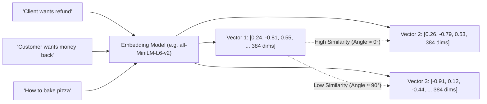

# 01. Dense Embeddings: Semantic Meaning in Multi-Dimensional Space

---

## 1. The Simple Real-World Analogy: GPS Coordinates for Ideas

Imagine you are standing in a city:
* If you want to describe where a coffee shop is, you give **GPS Coordinates**: `(Latitude: 32.7767, Longitude: -96.7970)`.
* Nearby places (like a bakery next door) will have **very similar GPS coordinates**.
* A place on the other side of the planet (like Tokyo) will have **completely different coordinates**.

**Dense Embeddings do the exact same thing for human language:**
Instead of 2 coordinates (Latitude & Longitude), an AI model translates words, sentences, and paragraphs into a list of **384, 768, or 1536 numerical coordinates** (called a **Vector** or **Embedding**).



---

## 2. Why is it Called "Dense"?

In AI, vectors are categorized as either **Sparse** or **Dense**:

* **Sparse Vector:** A list of 50,000 numbers where **99.9% are zeros**, and only 5 or 6 numbers are non-zero (like traditional keyword counting).
* **Dense Vector:** A list of numbers (e.g., 384 dimensions) where **every single position contains a meaningful non-zero decimal number** (e.g., `0.142, -0.871, 0.053`). Every number captures a subtle dimension of semantic meaning (e.g., sentiment, topic, tense, entity type).

---

## 3. How Similarity is Calculated: Cosine Distance

To find if two pieces of text mean the same thing, we calculate the angle $\theta$ between their vectors using **Cosine Similarity**:

$$\text{Cosine Similarity} = \cos(\theta) = \frac{\mathbf{A} \cdot \mathbf{B}}{\|\mathbf{A}\| \|\mathbf{B}\|}$$

* **Score = 1.0:** Identical semantic meaning.
* **Score = 0.0:** Completely unrelated topics.
* **Score = -1.0:** Opposite meaning.

In PostgreSQL with `pgvector`, we use the cosine distance operator `<=>`:
```sql
-- Finds the top 5 chunks closest in meaning to the user query
SELECT id, content, 1 - (embedding <=> :query_vector::vector) AS similarity_score
FROM document_chunks
ORDER BY embedding <=> :query_vector::vector
LIMIT 5;
```

---

## 4. Strengths & Fatal Flaws of Dense Embeddings

### 🟢 Strengths:
1. **Understands Synonyms:** Knows that *"automobile"*, *"car"*, and *"vehicle"* represent the same concept.
2. **Multilingual & Cross-Lingual:** Can match a question in English to a concept explained in Hindi or Spanish.
3. **Typo Resilient:** Handles mild misspellings gracefully.

### 🔴 The Fatal Flaw (The Alphanumeric Blindspot):
Dense embeddings compress entire sentences into fixed-size numbers. Because of this compression, they **struggle with exact strings, error codes, and IDs**:
* An embedding model might think `ERR_CODE_501` and `ERR_CODE_502` have a similarity of `0.98` (because both are "error codes"), even though in software they mean completely different bugs!
* It might confuse `Clause 8.1` with `Clause 8.2`.

👉 **Solution:** This is why we combine Dense Embeddings with **BM25 Sparse Search** (explained in Document 02).

---

## 5. Quick Python Code Example

```python
from sentence_transformers import SentenceTransformer
import numpy as np

# Load a lightweight, high-speed 384-dimensional embedding model
model = SentenceTransformer('sentence-transformers/all-MiniLM-L6-v2')

sentences = [
    "How do I request a refund?",
    "Where can I get my money back?",
    "What is the capital of France?"
]

# Generate dense vector embeddings
embeddings = model.encode(sentences)

# Calculate cosine similarity between sentence 0 and sentence 1
sim_0_1 = np.dot(embeddings[0], embeddings[1]) / (np.linalg.norm(embeddings[0]) * np.linalg.norm(embeddings[1]))
sim_0_2 = np.dot(embeddings[0], embeddings[2]) / (np.linalg.norm(embeddings[0]) * np.linalg.norm(embeddings[2]))

print(f"Similarity (Refund vs Money Back): {sim_0_1:.4f}")  # ~0.87 (Very High)
print(f"Similarity (Refund vs France):     {sim_0_2:.4f}")  # ~0.05 (No relation)
```
