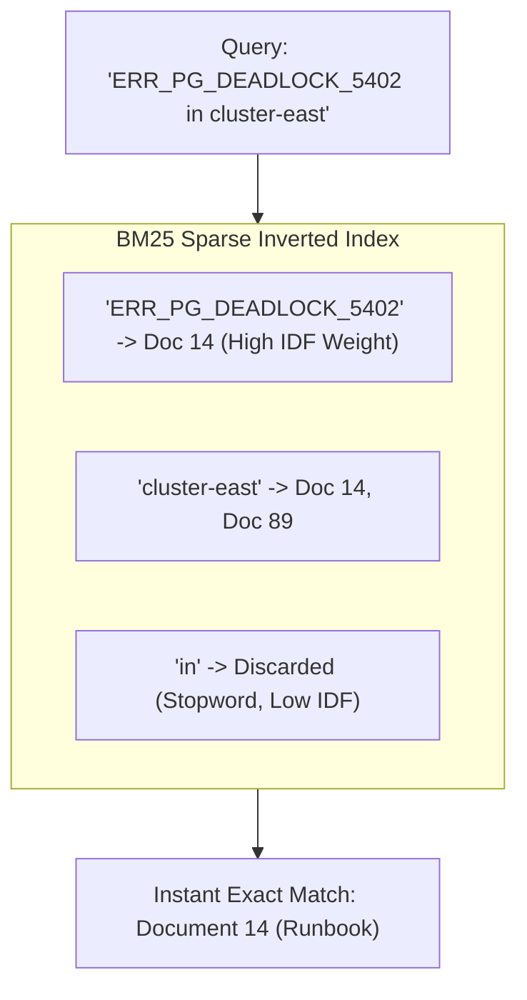

# 02. BM25 Sparse Search: Exact Keyword Retrieval

---

## 1. The Simple Real-World Analogy: The Textbook Index

When you want to find an exact term in a 1,000-page medical or engineering textbook (e.g., `"Acetaminophen"` or `"RFC 2616"`):
* You don't read every page trying to understand its vibe.
* You flip straight to the **alphabetical index at the back of the book**.
* The index tells you: *"Page 42, Page 119, Page 850"*.

**BM25 (Best Matching 25) is the mathematical gold standard of textbook indexes for search engines.**



---

## 2. Why is it Called "Sparse"?

In a Sparse search system:
* The vocabulary of English has roughly **100,000 unique words**.
* A single document chunk might only contain **50 unique words**.
* If you represent that document as a vector across the entire vocabulary, **99.95% of the vector is 0**. Only the 50 words actually present receive a weight.

Because almost all entries are empty (zero), computer scientists call this a **Sparse Vector representation**.

---

## 3. How the BM25 Formula Works (Simplified)

BM25 scores how relevant a document $D$ is to a query $Q$ using three intuitive principles:

$$\text{BM25 Score}(D, Q) = \sum_{q \in Q} \text{IDF}(q) \cdot \frac{\text{TF}(q, D) \cdot (k_1 + 1)}{\text{TF}(q, D) + k_1 \cdot \left(1 - b + b \cdot \frac{|D|}{\text{avgdl}}\right)}$$

### The 3 Core Components:
1. **TF (Term Frequency):** How many times does the query word appear in this document? (More matches = higher score, with diminishing returns).
2. **IDF (Inverse Document Frequency):** How rare is this word across the entire database?
   * Words like *"the"*, *"is"*, *"what"* appear in every document $\rightarrow$ **IDF score is nearly 0**.
   * Words like `ERR_PG_DEADLOCK_5402` or `CUST-9821` appear in only 1 document $\rightarrow$ **IDF score is massive!**
3. **Document Length Normalization ($b$):** Prevents long 50-page documents from getting unfairly high scores just because they contain more total words.

---

## 4. How PostgreSQL Implements BM25 Full-Text Search

PostgreSQL provides native Full-Text Search (FTS) using two built-in data types:
* `tsvector`: A pre-processed, stemmed list of words in a document with their positions.
* `tsquery`: The parsed user search query.

In OmniQuery-AI, we execute sparse search using PostgreSQL's cover density ranking `ts_rank_cd`:

```sql
-- Finds documents containing the exact keywords ranked by BM25 relevance
SELECT id, document_id, content,
       ts_rank_cd(tsv_content, plainto_tsquery('english', :query_text)) AS bm25_score
FROM document_chunks
WHERE tsv_content @@ plainto_tsquery('english', :query_text)
ORDER BY bm25_score DESC
LIMIT 10;
```

---

## 5. Strengths & Fatal Flaws of BM25

### 🟢 Strengths:
1. **Unbeatable on Exact Identifiers:** Error codes, serial numbers, part numbers, person names, and URLs.
2. **Deterministic & Auditable:** You can inspect exactly why a document ranked #1 (e.g., *"Matched term X with IDF 8.4"*).
3. **Extremely Fast:** Inverted indexes can search millions of documents in sub-milliseconds.

### 🔴 The Fatal Flaw (Vocabulary Mismatch):
BM25 has **zero concept of semantics or synonyms**:
* If the user searches *"headache remedies"*, but the doctor's document says *"migraine treatment"*, BM25 scores it as **0.0 (No Match)** because none of the exact words overlap!

👉 **Solution:** This is why we combine **BM25 Sparse** with **Dense Embeddings** in a **Hybrid Retrieval** engine (explained in Document 03).
