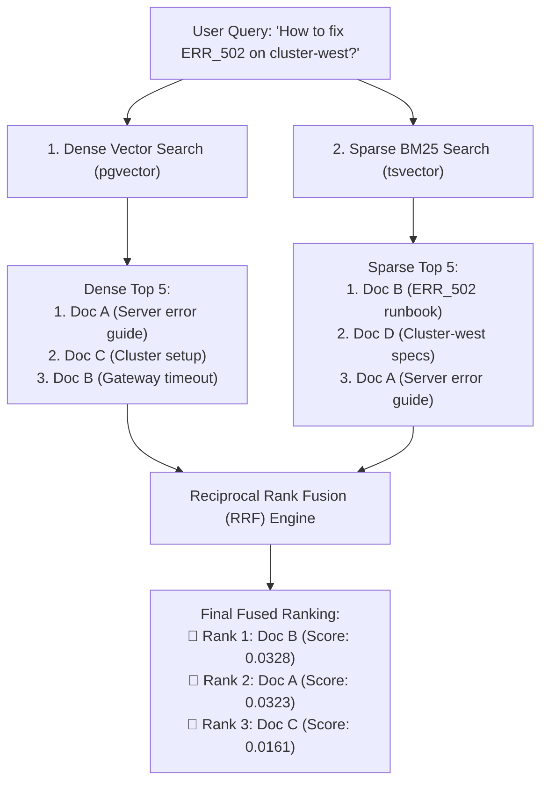

# 03. Hybrid Retrieval & Reciprocal Rank Fusion (RRF)

---

## 1. The Real-World Analogy: Two Specialized Investigators

Imagine an FBI task force solving a case with two lead detectives:
1. **Detective A (The Semantic Profiler / Dense Vector):** Understands psychological profiles, motivations, motives, and synonyms. Great at high-level concepts, but forgets exact license plate numbers.
2. **Detective B (The Forensic Analyst / Sparse BM25):** Tracks exact serial numbers, DNA codes, fingerprint IDs, and phone numbers. Has no idea about motives, but never forgets an exact number.

If you rely on only Detective A, you might arrest someone with the right motive but wrong identity.
If you rely on only Detective B, you miss the suspect who used an alias.

**Hybrid Retrieval unites both detectives.** Reciprocal Rank Fusion (RRF) is the mathematical formula that merges their two ranked lists into one superior, foolproof evidence dossier.



---

## 2. The Math Behind Reciprocal Rank Fusion (RRF)

When merging two different search engines, you cannot simply add their raw scores:
* Cosine similarity produces scores between `0.0` and `1.0`.
* BM25 produces scores between `0.0` and `50.0+`.

Adding them directly would cause BM25 to completely overpower the dense search!

**RRF solves this by ignoring raw score values and looking ONLY at rankings (positions 1st, 2nd, 3rd...):**

$$\text{RRF\_Score}(d) = \sum_{m \in M} \frac{1}{k + \text{rank}_m(d)}$$

Where:
* $M$ = The set of retrieval systems (Dense and Sparse).
* $\text{rank}_m(d)$ = The position of document $d$ in system $m$ (1-indexed: 1, 2, 3...).
* $k$ = A smoothing constant (the industry standard default is **$k = 60$**).

### Why $k=60$?
The constant $60$ ensures that a document ranked #1 doesn't completely blow away a document ranked #2 or #3, allowing documents that appear in **both** lists (even at ranks 2 and 3) to beat a document that appeared at rank 1 in only one list.

---

## 3. Step-by-Step RRF Calculation Example

Let's calculate the score for **Doc B** from our diagram above:
* In Dense Search, Doc B was ranked **#3** $\rightarrow \text{Score} = \frac{1}{60 + 3} = \frac{1}{63} \approx 0.01587$
* In Sparse Search, Doc B was ranked **#1** $\rightarrow \text{Score} = \frac{1}{60 + 1} = \frac{1}{61} \approx 0.01639$
* **Total Fused RRF Score for Doc B** = $0.01587 + 0.01639 = \mathbf{0.03226}$

Because Doc B appeared high on **both** lists, its fused score wins 1st place!

---

## 4. Implementation in OmniQuery-AI (`app/rag/hybrid_retriever.py`)

Here is how we implement this exact logic in Python:

```python
from typing import List, Dict, Any

def reciprocal_rank_fusion(
    dense_results: List[Dict[str, Any]], 
    sparse_results: List[Dict[str, Any]], 
    k: int = 60
) -> List[Dict[str, Any]]:
    scores = {}
    doc_map = {}

    # Accumulate RRF points from Dense Vector search
    for rank, doc in enumerate(dense_results):
        doc_id = doc["id"]
        doc_map[doc_id] = doc
        scores[doc_id] = scores.get(doc_id, 0.0) + (1.0 / (k + rank + 1))

    # Accumulate RRF points from Sparse BM25 search
    for rank, doc in enumerate(sparse_results):
        doc_id = doc["id"]
        if doc_id not in doc_map:
            doc_map[doc_id] = doc
        scores[doc_id] = scores.get(doc_id, 0.0) + (1.0 / (k + rank + 1))

    # Sort documents by fused RRF score descending
    sorted_doc_ids = sorted(scores.keys(), key=lambda x: scores[x], reverse=True)
    return [doc_map[did] for did in sorted_doc_ids]
```

---

## 5. Why Top Bangalore Tech Companies Demand Hybrid RAG in 2026

Recruiters at companies like Sarvam AI, Yellow.ai, and Krutrim specifically test candidates on this question:
> *"Why not just use OpenAI vector embeddings for everything?"*

**The Winning Answer:**
> *"Naive vector search fails on exact keyword identifiers, part numbers, and error codes due to semantic compression loss. Hybrid Search with Reciprocal Rank Fusion combines the semantic breadth of dense embeddings with the exact lexical precision of BM25, achieving superior Recall@K and eliminating out-of-vocabulary blindspots without requiring fragile manual prompt tuning."*
