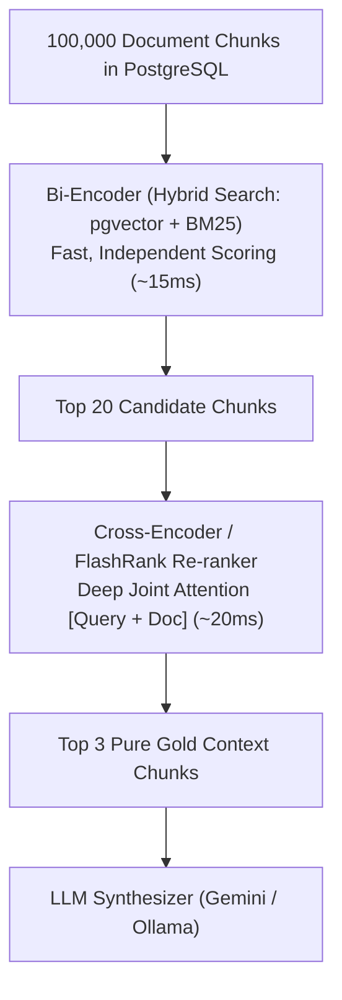

# 04. Cross-Encoder Re-ranking: Deep Context Compression

---

## 1. The Real-World Analogy: Speed Dating vs. An In-Depth Interview

To understand why we need a Re-ranker, consider hiring candidates for a software job:

1. **Step 1 (The Resume Filter / Bi-Encoder Vector Search):**
   * You have **100,000 resumes**.
   * An automated algorithm scans each resume independently in 0.001 seconds.
   * It filters the 100,000 resumes down to the **Top 20 candidates**.
   * *Problem:* Some resumes had great keywords, but in reality, the person isn't the right fit.

2. **Step 2 (The In-Depth Technical Interview / Cross-Encoder Re-ranker):**
   * You cannot interview all 100,000 people (too slow and expensive).
   * But you **can** conduct an in-depth 1-on-1 interview with the **Top 20 candidates**.
   * The interviewer asks targeted questions, compares the person directly against the exact job requirements, and picks the **Top 3 absolute best performers**.



---

## 2. Technical Difference: Bi-Encoder vs. Cross-Encoder

| Dimension | Bi-Encoder (Dense Embeddings) | Cross-Encoder (Re-ranker) |
| :--- | :--- | :--- |
| **How it computes** | Encodes Query and Document **separately** into independent vectors, then does a dot product. | Feeds `[CLS] Query [SEP] Document` **together** into the transformer at the exact same time. |
| **Self-Attention** | Query words cannot attend to Document words during encoding. | **Full Cross-Attention:** Every word in the query interacts with every word in the document simultaneously. |
| **Speed** | ⚡ Blazing fast ($O(1)$ lookup via index). | 🐢 Slower ($O(N)$ full transformer forward pass per document). |
| **Accuracy** | Good ($\approx 75-80\%$). | 🎯 Extremely high ($\approx 95\%+$). |

---

## 3. Why Not Send All Top 20 Documents Directly to the LLM?

Why do we need a Re-ranker if modern LLMs have 128k or 1M token context windows?

1. **"Lost in the Middle" Problem:** Research shows that LLMs pay high attention to text at the very beginning and very end of their prompt, but **ignore information buried in the middle** of large contexts.
2. **Cost & Latency:** Feeding 20 chunks multiplies token costs and adds 2-3 seconds of generation latency.
3. **Hallucination Reduction:** Re-ranking filters out misleading or distracting semi-relevant chunks, giving the LLM only the ground-truth facts.

---

## 4. Lightweight Implementation in OmniQuery-AI (FlashRank)

In OmniQuery-AI, we use **FlashRank**—an ultra-fast, CPU-optimized re-ranking library based on quantized Cross-Encoders (`ms-marco-TinyBERT` / `bge-reranker`). It runs in under **15 milliseconds on a standard laptop CPU with zero GPU requirements!**

```python
from flashrank import Ranker, RerankRequest

# Initialize lightweight CPU-optimized ranker
ranker = Ranker(model_name="ms-marco-TinyBERT-L-2-v2", cache_dir="/tmp")

query = "What is the return policy for water damaged electronics?"
passages = [
    {"id": 1, "text": "Clothing returns are accepted within 30 days of purchase."},
    {"id": 2, "text": "Electronics with liquid or water damage are strictly non-refundable under Section 4.2."},
    {"id": 3, "text": "We sell high-quality water-resistant smartwatches with 2-year warranty."}
]

# Cross-Encoder evaluates the joint relationship between query and each passage
rerank_request = RerankRequest(query=query, passages=passages)
results = ranker.rerank(rerank_request)

# Passage 2 immediately jumps to Rank #1 with highest score!
print(f"Top Result ID: {results[0]['id']} | Score: {results[0]['score']:.4f}")
```
