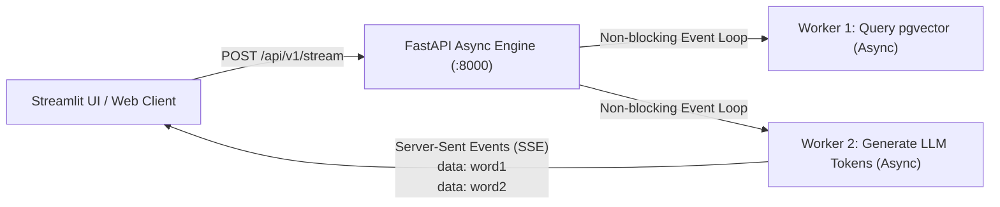

# 05. FastAPI Backend: High-Throughput Async REST & Token Streaming

---

## 1. The Real-World Analogy: The Ultra-Fast Drive-Thru vs. A Slow Dine-In Restaurant

* **Old Python Frameworks (Flask / Django - Sync):** 
  Imagine a waiter who takes your order, walks into the kitchen, stands next to the chef for 10 minutes while your burger cooks, and refuses to talk to any other customer until your burger is delivered. If 100 people enter the restaurant, everyone is stuck waiting in a massive line outside.
* **FastAPI (Asynchronous Event Loop):**
  The cashier takes your order in 2 seconds, hands a ticket to the kitchen, and immediately serves the next 50 customers. While the database and AI models are "cooking", the server continues handling new requests without blocking.



---

## 2. Why FastAPI is the Industry Standard for GenAI in 2026

1. **Native Async/Await Support:** Built on `Starlette` and `uvloop`, achieving performance on par with NodeJS and Go.
2. **Automatic Type Validation (Pydantic):** Prevents runtime bugs by automatically validating request/response JSON schemas.
3. **Automatic Interactive Swagger Documentation:** Generates interactive API testing docs out-of-the-box at `http://localhost:8000/docs`.
4. **First-Class Streaming Support:** Ideal for token-by-token streaming via Server-Sent Events (SSE).

---

## 3. Real-Time Token Streaming via Server-Sent Events (SSE)

In GenAI applications, generating a full 500-word answer might take 4–5 seconds. If the user stares at a blank screen or a loading spinner for 5 seconds, it feels sluggish.

**Server-Sent Events (SSE)** opens a one-way persistent HTTP stream using `media_type="text/event-stream"`. The backend pushes words to the client the instant they are generated:

```python
import asyncio
from fastapi import FastAPI
from fastapi.responses import StreamingResponse
from pydantic import BaseModel

app = FastAPI()

class QueryRequest(BaseModel):
    query: str

@app.post("/api/v1/stream")
async def stream_ai_tokens(request: QueryRequest):
    async def token_generator():
        # In real OmniQuery-AI, this yields tokens live from LLM / LangGraph
        response_text = f"Analyzing database and policies for: {request.query}"
        for word in response_text.split(" "):
            yield f"data: {word} \n\n"
            await asyncio.sleep(0.05)  # Simulates token delivery
            
    return StreamingResponse(token_generator(), media_type="text/event-stream")
```

---

## 4. Swagger API Documentation

When you run FastAPI via `uvicorn app.main:app --reload`, visiting `http://localhost:8000/docs` displays the Swagger interface:

* Try out queries directly from your browser.
* Inspect request bodies and expected responses.
* Export OpenAPI JSON schema for client SDK generation.
