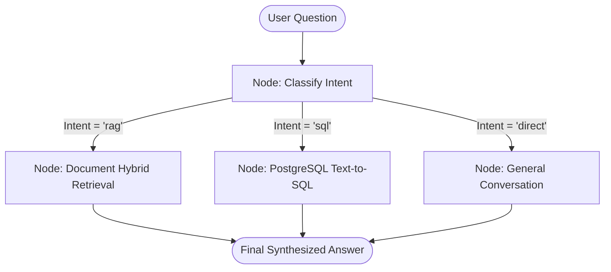

# 06. LangGraph State Router: Multi-Agent State Machines

---

## 1. The Real-World Analogy: The Hospital Reception Triage

When a patient walks into a hospital:
1. **The Triage Nurse (The Classifier Node):** Evaluates the symptoms.
2. **Dynamic Routing (Conditional Edges):**
   * If bone fracture $\rightarrow$ Send to **X-Ray & Orthopedics (SQL Agent)**.
   * If complex disease symptoms $\rightarrow$ Send to **Medical Research Library (Document RAG)**.
   * If asking for visiting hours $\rightarrow$ Answer immediately at the **Front Desk (Direct LLM)**.



---

## 2. What is LangGraph?

**LangGraph** is an open-source orchestration library created by the LangChain team. Unlike traditional linear chains (where Step A always leads to Step B), LangGraph enables **Cyclic Graphs, Conditional Branching, and State Persistence**.

### The 3 Core Building Blocks:
1. **State (`AgentState`):** A shared Python dictionary or `TypedDict` that stores the conversation state, retrieved context, SQL queries, and generated answers.
2. **Nodes (`workflow.add_node`):** Python functions that take the current `state`, perform an action (e.g., execute SQL, fetch documents), update the state, and return it.
3. **Edges & Conditional Edges (`add_conditional_edges`):** Decision routers that determine which node to execute next based on what's currently in the state.

---

## 3. How We Implement the State Graph in OmniQuery-AI (`app/agents/router.py`)

```python
from typing import TypedDict, Literal, Optional
from langgraph.graph import StateGraph, END

# 1. Define the Global State Schema
class AgentState(TypedDict):
    query: str
    query_type: Optional[Literal["rag", "sql", "direct"]]
    context: Optional[str]
    sql_query: Optional[str]
    response: Optional[str]

# 2. Define Node Functions
def classify_intent_node(state: AgentState) -> AgentState:
    query = state["query"].lower()
    sql_keywords = ["how many", "count", "total", "sales", "revenue", "orders", "users"]
    doc_keywords = ["policy", "explain", "terms", "guide", "what is", "how do i"]
    
    if any(k in query for k in sql_keywords):
        state["query_type"] = "sql"
    elif any(k in query for k in doc_keywords):
        state["query_type"] = "rag"
    else:
        state["query_type"] = "direct"
    return state

def route_decision(state: AgentState) -> str:
    return state["query_type"]

def rag_handler_node(state: AgentState) -> AgentState:
    # Executes hybrid search and re-ranking
    state["response"] = f"Document RAG Answer for '{state['query']}'"
    return state

def sql_handler_node(state: AgentState) -> AgentState:
    # Executes read-only Text-to-SQL
    state["response"] = f"SQL Database Result for '{state['query']}'"
    return state

def direct_node(state: AgentState) -> AgentState:
    state["response"] = "Hello! I am your enterprise AI copilot."
    return state

# 3. Assemble the State Graph
workflow = StateGraph(AgentState)
workflow.add_node("classifier", classify_intent_node)
workflow.add_node("rag_node", rag_handler_node)
workflow.add_node("sql_node", sql_handler_node)
workflow.add_node("direct_node", direct_node)

workflow.set_entry_point("classifier")
workflow.add_conditional_edges(
    "classifier",
    route_decision,
    {"rag": "rag_node", "sql": "sql_node", "direct": "direct_node"}
)

workflow.add_edge("rag_node", END)
workflow.add_edge("sql_node", END)
workflow.add_edge("direct_node", END)

agent_app = workflow.compile()
```

---

## 4. Why LangGraph is Crucial for 2026 Bangalore Job Interviews

Hiring managers look for candidates who understand **multi-agent architectures** rather than simple one-line prompt chains. Being able to explain state graphs, cyclic agent retries, and conditional edge routing is a key differentiator for ₹10–16 LPA GenAI roles.
