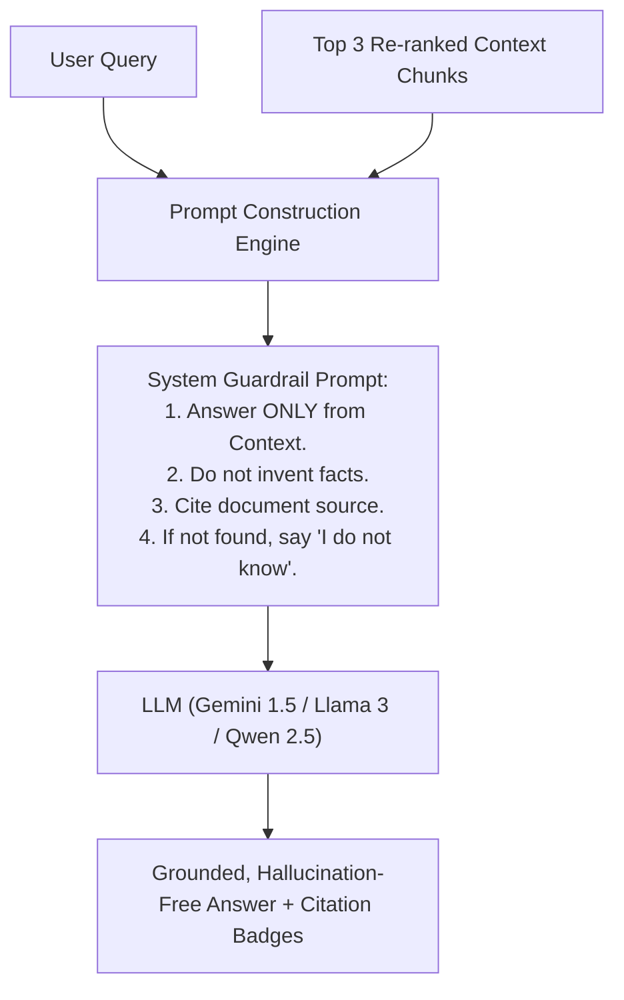

# 07. LLM Synthesizer: Grounded Generation & Anti-Hallucination Guardrails

---

## 1. The Real-World Analogy: The Executive Assistant & Briefing Memo

Imagine a CEO asking their Chief of Staff: *"What did the auditor say about our European tax liability?"*
* **A Bad Assistant (Hallucinating LLM):** Guesses from memory or makes up a plausible-sounding number because they want to appear helpful.
* **A Good Assistant (Grounded LLM Synthesizer):** Opens the auditor's 50-page PDF report, flips to Section 3.2, extracts the exact facts, and writes a crisp 2-bullet briefing memo citing *"Page 14, Paragraph 2"*. If the document does not mention European taxes, they explicitly state: *"The report does not contain information on European tax liability."*



---

## 2. What is LLM Synthesis?

In Retrieval-Augmented Generation (RAG), the LLM is **not** used as a database of facts. Instead, the LLM is treated as a **reasoning and summarization engine**.

The process works in 3 steps:
1. **Context Extraction:** The Hybrid Retrieval engine fetches the top re-ranked text passages (or SQL result rows).
2. **Prompt Assembly:** The system wraps the user query and retrieved context inside an anti-hallucination prompt template.
3. **Synthesis:** The LLM generates natural human language answering the query using *only* the injected context.

---

## 3. The Anti-Hallucination Prompt Template

Here is the exact prompt pattern we use in OmniQuery-AI:

```python
SYNTHESIZER_SYSTEM_PROMPT = """
You are OmniQuery-AI, an enterprise assistant for verified document and database queries.

STRICT INSTRUCTIONS:
1. Answer the user's question using ONLY the factual information provided in the [CONTEXT] block below.
2. Do NOT extrapolate, speculate, or introduce external knowledge not present in the context.
3. If the context does not contain enough information to answer the question with 100% certainty, reply with:
   "I apologize, but our official documentation does not contain sufficient details to answer this query."
4. Always cite the document title and section when providing an answer.

[CONTEXT]:
{retrieved_context}

[USER QUESTION]:
{user_query}
"""
```

---

## 4. Supported LLM Providers in OmniQuery-AI

OmniQuery-AI is architected to work with both **free local models** (zero cost, 100% private) and **cloud models**:

* **Local / Offline (Free):** Ollama running `llama3:latest` or `qwen2.5:latest` on port `11434`.
* **Cloud API (Free Tier):** Google Gemini 1.5 Flash via `google-generativeai` SDK.
* **Enterprise Cloud:** OpenAI (`gpt-4o`) or Groq (`llama-3.1-70b-versatile`).
