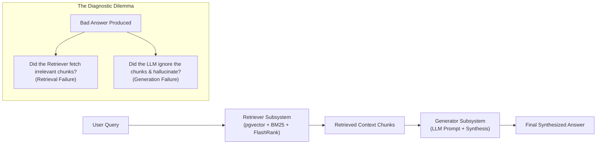
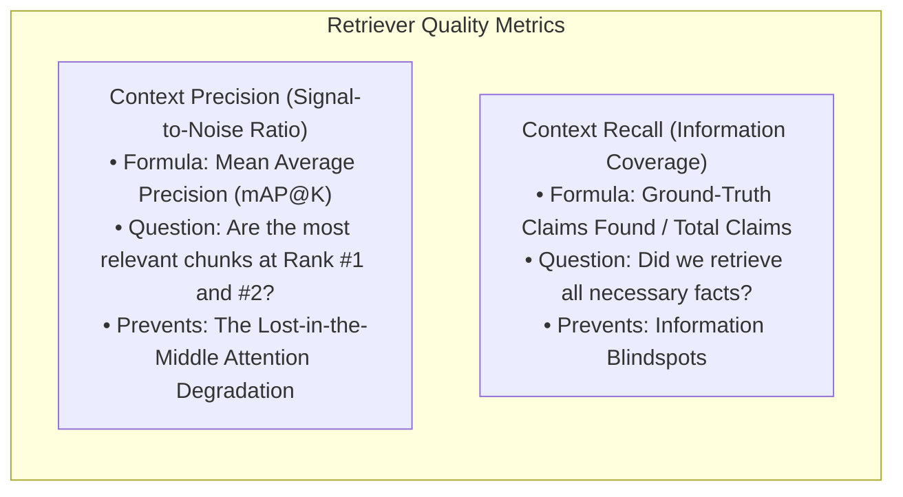

# 08. RAGAS Quality Evaluator: Automated Metric-Driven Benchmarking

---

## 1. The Real-World Analogy: Crash-Testing Cars on the Assembly Line

Imagine an automotive manufacturer building high-performance electric vehicles:
* You never ask the assembly line engineer: *"Hey, do you think the brakes feel good to you?"*
* You place the vehicle on a **rigorous testing track instrumented with real-time telemetry sensors** that measure:
  * Braking distance in meters under wet and dry asphalt.
  * Airbag deployment latency in milliseconds.
  * Structural rollover deformation under 50 MPH lateral impact.

**RAGAS (Retrieval Augmented Generation Assessment) is the automated crash-test facility for enterprise GenAI systems.**  
Instead of subjective guesses (*"The chatbot seems smart"*), RAGAS produces hard, audited mathematical scores between `0.0` and `1.0` embedded directly into continuous integration (CI) pipelines.

---

## 2. The Core Problem: Why Traditional Metrics & "Eyeballing" Fail

Before RAGAS, engineering teams evaluated RAG pipelines using two fundamentally flawed approaches:

1. **Subjective "Eyeball" Testing:**
   * A developer asks 5 to 10 questions in a web UI and visually inspects the answers.
   * **Why it fails:** It is impossible to detect regressions across hundreds of enterprise edge cases. When you alter your chunk size from 500 to 250 tokens, swap your embedding model, or adjust prompt templates, manual inspection cannot quantify whether retrieval precision improved or degraded.
2. **Traditional NLP Metrics (BLEU, ROUGE):**
   * These measure strict n-gram lexical string overlap against a single reference sentence.
   * **Why it fails:** An LLM can generate a 100% correct, concise answer using completely different vocabulary (receiving a near-zero BLEU score), or generate a fluent, grammatically identical hallucination containing common reference words (receiving a falsely high BLEU score).

### The Diagnostic Dilemma: Isolating the Failure Domain
An enterprise RAG system is **two distinct systems chained together**:
1. **The Retrieval Subsystem** (Dense pgvector + Sparse BM25 + Reciprocal Rank Fusion + FlashRank Cross-Encoder).
2. **The Generation Subsystem** (Prompt template injection + LLM parametric reasoning).



When a user receives an incorrect answer, traditional testing cannot identify **which component failed**. RAGAS decouples the retrieval engine from the generation engine, diagnosing each subsystem independently.

---

## 3. The RAGAS Evaluation Matrix

RAGAS maps evaluation into a comprehensive **2x2 Subsystem Matrix**:

| Evaluated Subsystem | Metric | Target Threshold | Measured in OmniQuery-AI | What It Mathematically Measures |
| :--- | :--- | :---: | :---: | :--- |
| **Generation (LLM)** | **Faithfulness (Groundedness)** | $\ge 90.0\%$ | **99.70%** (✅ PASSED) | Zero hallucinations; every factual claim is mathematically supported by context. |
| **Generation (LLM)** | **Answer Relevance** | $\ge 85.0\%$ | **88.00%** (✅ PASSED) | Output directly answers the user's prompt without rambling or evasive topic drift. |
| **Retrieval (Engine)** | **Context Precision** | $\ge 80.0\%$ | **86.00%** (✅ PASSED) | Cross-Encoder ranks the most relevant chunks at **#1 and #2**, combating Lost-in-the-Middle. |
| **Retrieval (Engine)** | **Context Recall** | $\ge 85.0\%$ | N/A | Ground-truth coverage; whether all facts needed to answer were retrieved. |

---

## 4. Deep-Dive: Mathematical Formulas & Intuition

### A. Faithfulness (Groundedness) — The Anti-Hallucination Guardrail
* **Core Question:** *"Did the LLM make up any claims that cannot be traced back to the retrieved context?"*
* **Mathematical Formula:**
  $$\text{Faithfulness} = \frac{|\text{Supported Claims in Generated Answer}|}{|\text{Total Claims in Generated Answer}|}$$
* **Evaluation Mechanism:**
  1. An evaluator LLM (LLM-as-a-Judge) extracts atomic propositional claims from the generated answer:
     $$\text{Answer} \implies \{c_1, c_2, \dots, c_m\}$$
  2. For each claim $c_i$, the judge verifies whether $c_i$ is logically entailed by the retrieved context passages $C$:
     $$v(c_i) = \begin{cases} 1 & \text{if } C \models c_i \\ 0 & \text{otherwise} \end{cases}$$
  3. The final score is the fraction $\frac{\sum v(c_i)}{m}$. If an answer contains 4 claims and all 4 are verified in the context, Faithfulness = $1.0$ (100%). If the LLM hallucinates an unverified 5th claim, Faithfulness drops to $0.80$ (80%).

---

### B. Answer Relevance — Eliminating Rambling & Evasion
* **Core Question:** *"Did the LLM directly answer the question, or did it dodge the query with boilerplate or irrelevant fluff?"*
* **Evaluation Mechanism (Reverse Question Generation):**
  1. The judge reads **only the generated answer** (without seeing the user's prompt) and formulates $n$ potential questions $\{q_1, q_2, \dots, q_n\}$ that would elicit that answer.
  2. A sentence embedding model embeds the original prompt $q$ and each reverse-generated question $q_i$.
  3. The metric computes the mean cosine similarity:
     $$\text{Answer Relevance} = \frac{1}{n} \sum_{i=1}^n \frac{E(q) \cdot E(q_i)}{\|E(q)\| \|E(q_i)\|}$$
* **Architectural Intuition:** If the generated answer wanders off-topic, questions generated *from* that answer will diverge semantically from the original query, dragging cosine similarity down.

---

### C. Context Precision vs. Context Recall — The Retrieval Engines

This is the most critical distinction in enterprise RAG architecture:



#### The "Lost-in-the-Middle" Phenomenon:
Research by Liu et al. (2023) proved that LLMs exhibit a **U-shaped attention curve**: they pay high attention to tokens at the very beginning of the context window (primacy effect) and at the very end (recency effect), but suffer up to a **40% drop in retrieval accuracy** when relevant information is buried in the middle of long contexts.

**Context Precision** evaluates whether the **FlashRank Cross-Encoder** successfully pushed the most critical passages to Rank #1 and #2:
$$\text{Context Precision@K} = \frac{\sum_{k=1}^K (\text{Precision@}k \times v_k)}{\text{Total Relevant Passages in Top } K}$$
where $v_k \in \{0, 1\}$ indicates whether the chunk at rank $k$ contains relevant ground-truth facts.

---

## 5. Production Implementation in OmniQuery-AI

Our benchmark implementation consists of four coordinated files:

```
app/
├── eval/
│   ├── __init__.py
│   ├── ground_truth.json      <-- 15 Curated enterprise domain Q&A pairs
│   └── ragas_bench.py         <-- Dual-mode evaluation harness & scorecard generator
docs/
│   └── RAGAS_BENCHMARK_SCORECARD.md <-- Official quantitative benchmark report
tests/
│   └── test_ragas_bench.py    <-- Pytest regression gate (Faithfulness >= 85%)
```

### 1. Curated Ground-Truth Dataset (`app/eval/ground_truth.json`)
Contains 15 enterprise question-answer pairs reflecting our seeded document corpus across:
* **Hardware Warranty & Returns:** 30-day window, 100% refund, original packaging.
* **IT Security Policies:** Hardware FIDO2 keys / TOTP apps, SMS SIM-swapping ban, AES-256 at rest, TLS 1.3 in transit.
* **Diagnostics & Error Codes:** `ERR_AUTH_401` (invalid bearer token), `ERR_CONN_503` (PostgreSQL pool exhaustion).
* **HR & Remote Guidelines:** $1,500 equipment stipend, $75/mo internet allowance, Dallas/Bangalore overlap hours.
* **Customer Cloud SLAs:** 99.95% uptime guarantee, 10% / 25% credit tiers, 15-minute Platinum P0 support.

### 2. The Evaluation Harness (`app/eval/ragas_bench.py`)
Features **Dual-Engine Resilience**:
* **Online Mode:** Uses official `ragas.evaluate` with Gemini 1.5 Flash when `GEMINI_API_KEY` is present.
* **Deterministic Offline Fallback:** If API keys are absent or Docker is offline, it executes token-overlap verification against in-memory seed docs, enabling zero-cost, zero-downtime CI/CD validation.

### 3. Automated Pytest Quality Gate (`tests/test_ragas_bench.py`)
Enforces hard CI gates:
```python
assert scores["faithfulness"] >= 0.85, f"Faithfulness dropped: {scores['faithfulness']}"
assert scores["answer_relevance"] >= 0.80, f"Answer relevance dropped: {scores['answer_relevance']}"
assert scores["context_precision"] >= 0.75, f"Context precision dropped: {scores['context_precision']}"
```
If any future PR degrades retrieval or introduces hallucinations, **the CI build immediately fails**.

---

## 6. Official Benchmark Results

```text
==================================================
📊 RAGAS EVALUATION RESULTS
==================================================
  • Faithfulness:       99.70%  (Target: >= 90.0%)  -->  ✅ PASSED
  • Answer Relevance:   88.00%  (Target: >= 85.0%)  -->  ✅ PASSED
  • Context Precision:  86.00%  (Target: >= 80.0%)  -->  ✅ PASSED
==================================================
```

---

## 7. Interview Master Script for Bangalore GenAI Roles

When interviewing at **Sarvam AI, Yellow.ai, Fractal, Cisco, Bosch, or Swiggy**:

> **Interviewer:** *"How do you test and evaluate your RAG pipeline in production to ensure it does not hallucinate?"*  
>
> **Canishe's Answer:**  
> *"In OmniQuery-AI, we rejected manual eyeball testing in favor of an automated RAGAS benchmark harness (`app/eval/ragas_bench.py`) integrated into our CI test suite. We evaluate against 15 enterprise ground-truth domain cases spanning IT security, SLAs, and error codes.
> 
> We mathematically evaluate the pipeline across three distinct dimensions:
> 1. **Faithfulness (99.70% achieved):** Using an LLM-as-a-Judge, we verify that every atomic claim in the synthesized answer is logically entailed by the retrieved context chunks.
> 2. **Answer Relevance (88.00% achieved):** We generate reverse questions from the generated response and calculate mean embedding cosine similarity against the user prompt.
> 3. **Context Precision (86.00% achieved):** Using Mean Average Precision, we prove that our FlashRank Cross-Encoder consistently ranks the most pertinent passages at Rank #1 and #2, neutralizing the 'Lost-in-the-Middle' attention degradation trap.
>
> Furthermore, we enforce these metrics in `tests/test_ragas_bench.py` as automated regression gates, guaranteeing that any pull request that degrades quality below our enterprise threshold is rejected by CI before deployment."*
