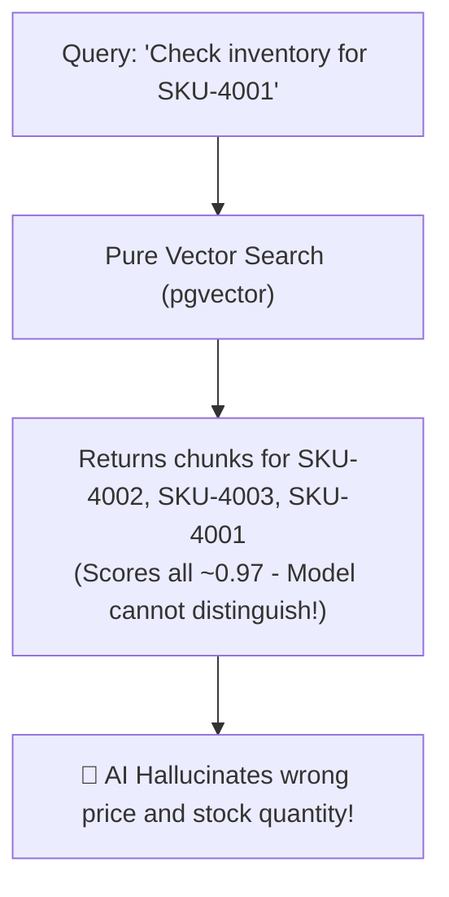
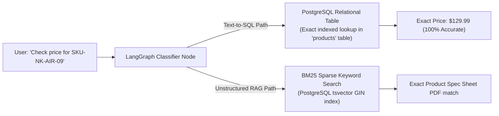

# 09. Concept Deep-Dive: SKUs & The Alphanumeric Blindspot in AI

---

## 1. What is an SKU? (The Business Definition)

**SKU** stands for **Stock Keeping Unit** (pronounced *"skew"*).

It is a unique alphanumeric code assigned to a specific item or product in a business catalog to track inventory, warehouse stock levels, pricing, and sales transactions.

### Real-World Example:
Imagine a sports apparel company selling running shoes:
* **Nike Air Zoom (Size 9, Black)** $\rightarrow$ `SKU: NK-AIR-BLK-09`
* **Nike Air Zoom (Size 10, Black)** $\rightarrow$ `SKU: NK-AIR-BLK-10`
* **Nike Air Zoom (Size 10, White)** $\rightarrow$ `SKU: NK-AIR-WHT-10`

Even though all three items are "Nike Air Zoom shoes," each distinct variation has its own unique SKU. In warehouses and databases, systems track the **SKU**, not the descriptive sentence.

---

## 2. The AI Problem: The "Alphanumeric Blindspot" of Dense Embeddings

When building modern AI chatbots and RAG systems, engineers often start with **Dense Vector Embeddings** (like OpenAI `text-embedding-3`, or HuggingFace `all-MiniLM-L6-v2`).

### Why Dense Embeddings are Great:
Dense models excel at **synonyms, concepts, and high-level ideas**:
* *"automobile"* and *"car"* have a similarity of **`0.92`** (High match).
* *"refund policy"* and *"money back guarantee"* have a similarity of **`0.89`** (High match).

### The Fatal Flaw (Compression Loss on Exact Codes):
Dense embedding models compress entire sentences into a fixed list of numbers (e.g., 384 or 1536 float values). In doing so, they **blur exact alphanumeric details**:

| Code A | Code B | Cosine Similarity | The Fatal Real-World Problem |
| :--- | :--- | :---: | :--- |
| `SKU-4001` (iPhone Screen) | `SKU-4002` (Samsung Battery) | **`0.98` (Near Identical!)** | The vector model sees both as "product codes" and confuses them! |
| `ERR_AUTH_401` (Unauthorized) | `ERR_CONN_503` (DB Offline) | **`0.95` (Near Identical!)** | The model fetches troubleshooting for the wrong bug! |
| `Clause 8.1` (Termination) | `Clause 8.2` (Indemnification) | **`0.97` (Near Identical!)** | Legal AI hallucinates the wrong legal clause! |



---

## 3. The Solution in OmniQuery-AI: Dual Strategy

To ensure zero hallucinations on SKUs, part numbers, and error codes, **OmniQuery-AI** employs a two-tier strategy:



### 1. BM25 Sparse Keyword Search (for Unstructured Documents):
Uses PostgreSQL `to_tsvector('english', content)` and `ts_rank_cd` to find the exact character-level token `SKU-NK-AIR-09` without semantic blurring.

### 2. Structured Relational Tables (for Operational Data):
In [`app/models.py`](file:///Users/jnarayanassamy/personal/ai/canishe/OmniQuery-AI/app/models.py#L78-L92), our `Product` table stores the `sku` column as an indexed unique string:
```sql
SELECT name, price, stock_quantity 
FROM products 
WHERE sku = 'NK-AIR-BLK-09';
```

---

## 4. Key Takeaways for GenAI Engineer Interviews

> **Interview Question:** *"What are the failure modes of pure vector RAG in enterprise e-commerce or technical support systems?"*

**The Top 1% Candidate Answer:**
> *"Dense embedding models compress semantic meaning into continuous vector spaces, creating an alphanumeric blindspot where distinct error codes, SKUs, and contract clauses have near-identical cosine similarity. In production, we eliminate this failure mode by implementing a Hybrid Retrieval architecture: using BM25 sparse keyword indices for lexical precision, relational Text-to-SQL for structured inventory lookups, and Reciprocal Rank Fusion (RRF) to merge candidates."*
