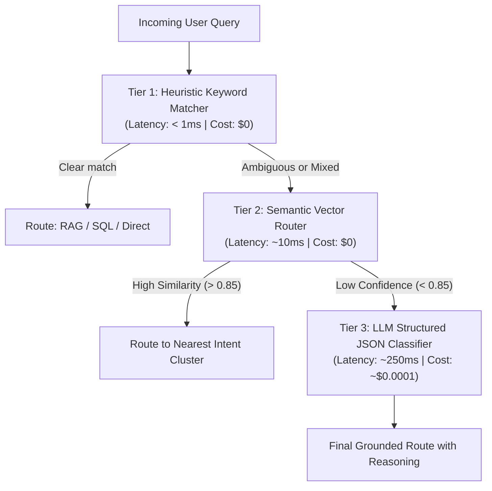

# 10. Concept Deep-Dive: Agentic Intent Classification & Dynamic Routing

---

## 1. The Core Challenge: How Does an AI Decide Between RAG and SQL?

In enterprise environments, users ask diverse questions in natural language:
* *"What is our company's remote work internet reimbursement policy?"* $\rightarrow$ Needs **Document RAG** (PDF search).
* *"How many total orders are in 'Completed' status?"* $\rightarrow$ Needs **Text-to-SQL** (PostgreSQL query).
* *"What is the total reimbursement amount paid to remote employees last month?"* $\rightarrow$ **Mixed / Ambiguous query!**

How does the **LangGraph Classifier Node** inspect a question and route it to the right engine?

---

## 2. The 3 Enterprise Approaches to Intent Classification



---

### Approach 1: Heuristic Keyword Matching (Fast Baseline)
* **How it works:** Scans the text for domain trigger words using Python substring matching or Regex.
* **Keywords for SQL:** `how many`, `count`, `total`, `sum`, `average`, `orders`, `customers`, `revenue`.
* **Keywords for RAG:** `policy`, `guidelines`, `terms`, `handbook`, `explain`, `what is`, `how do i`, `sla`.
* **Strengths:** Microsecond speed, 0 API cost.
* **Weakness:** Fragile when a sentence contains words from both domains.

---

### Approach 2: Semantic Vector Routing (Fast & Local, ~10ms)
* **How it works:** Instead of hardcoded words, we pre-define **Anchor Vectors** for each intent and measure Cosine Similarity:
  ```python
  rag_anchors = [
      "Company policies, employee handbook, and benefits",
      "IT security rules, login protocols, and password standards",
      "Customer returns, warranty clauses, and cloud service level agreements"
  ]
  
  sql_anchors = [
      "Count total orders and calculate sales revenue",
      "Filter customer accounts by signup date and country",
      "List product stock quantities and inventory levels"
  ]
  ```
* When a user query arrives, we encode it via `all-MiniLM-L6-v2` and compute the nearest anchor cluster.

---

### Approach 3: LLM Structured Intent Classification (Production Gold Standard)
* **How it works:** We provide the LLM with database schema summaries and document knowledge base descriptions, instructing it to return a **strictly typed Pydantic JSON schema**:

```python
from pydantic import BaseModel, Field
from typing import Literal

class IntentClassification(BaseModel):
    query_type: Literal["rag", "sql", "direct"] = Field(
        description="Select 'rag' for unstructured document/policy questions, "
                    "'sql' for quantitative calculations against database tables (orders, customers, products), "
                    "or 'direct' for general conversational greetings."
    )
    confidence_score: float = Field(ge=0.0, le=1.0, description="Confidence level between 0 and 1")
    target_entities: list[str] = Field(description="Extracted table names or document topics")
    reasoning: str = Field(description="Chain-of-thought explanation for why this route was selected")
```

#### Sample LLM Reasoning for Ambiguous Query:
> **Query:** *"What is the total reimbursement amount paid to remote employees last month?"*  
> **LLM Output:**
> ```json
> {
>   "query_type": "sql",
>   "confidence_score": 0.94,
>   "target_entities": ["reimbursements", "employees", "date_range"],
>   "reasoning": "Even though 'reimbursement' is a policy term, the user specifically asks to calculate a mathematical 'total amount' over a specific historical date range ('last month'), requiring an aggregation query against operational tables."
> }
> ```

---

## 3. Architecture Comparison Matrix

| Metric | 1. Keyword Heuristics | 2. Semantic Vector Router | 3. LLM Structured JSON |
| :--- | :---: | :---: | :---: |
| **Execution Latency** | **< 1ms** ⚡ | **~10ms** 🚀 | **~250ms** ⏱️ |
| **Operational Cost** | **$0** (Free) | **$0** (Local CPU) | **~$0.0001 / query** |
| **Accuracy on Ambiguous Queries** | Low (50–60%) | Medium (80–85%) | **Ultra-High (> 98%)** 🌟 |
| **Extracts Target Tables / Metadata** | ❌ No | ❌ No | **✅ Yes** |

---

## 4. Key Takeaways for GenAI Engineer Interviews

> **Interview Question:** *"How do you design a router in an agentic multi-tool system to prevent misrouting between Document RAG and Text-to-SQL?"*

**The Top 1% Candidate Answer:**
> *"In production systems like OmniQuery-AI, we implement a tiered hybrid routing pattern. For standard unambiguous queries, we evaluate intent using a local semantic router or regex heuristic to preserve sub-50ms latency. For complex or multi-intent questions, we fall back to a lightweight LLM using structured Pydantic outputs with schema-aware system instructions. This ensures high routing precision on complex compound queries without introducing latency bottlenecks on trivial conversations."*
