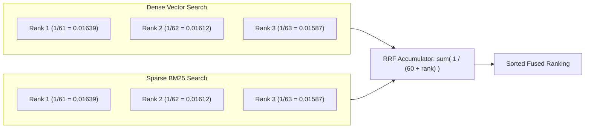

# 11. Concept Deep-Dive: Reciprocal Rank Fusion (RRF) & Mathematical Worked Examples

---

## 1. Why RRF Exists: The "Apples vs. Oranges" Score Mismatch

When building Hybrid RAG systems, we run two search algorithms over the same document collection:
1. **Dense Cosine Vector Search (`pgvector`):** Produces a bounded similarity score:
   $$\text{Score}_{\text{dense}} \in [0.0, 1.0]$$
2. **Sparse BM25 Keyword Search (`tsvector`):** Produces an unbounded term-frequency score:
   $$\text{Score}_{\text{sparse}} \in [0.0, \infty) \quad (\text{e.g., } 18.42, 9.15, 3.20)$$

### ❌ Why Raw Score Addition Fails:
If you attempt to calculate `Combined Score = Score_dense + Score_sparse`:
* Dense match: `0.85`
* Sparse match: `18.40`
* `Combined = 0.85 + 18.40 = 19.25`

The BM25 score contributes **95.6% of the final weight**, completely overwhelming and destroying the semantic benefits of the vector search!

---

## 2. The Reciprocal Rank Fusion (RRF) Mathematical Formula

Instead of trying to normalize unstable raw scores, **RRF converts every score into a position rank (1st, 2nd, 3rd...)**:

$$\text{RRF Score}(d) = \sum_{m \in M} \frac{1}{k + r_m(d)}$$

Where:
* $M$: The set of search engines ($M = \{\text{Dense}, \text{Sparse}\}$).
* $r_m(d)$: The 1-based rank position of document $d$ in search engine $m$ (i.e., $1, 2, 3, \dots$). If a document does not appear in engine $m$'s top candidate list, its reciprocal term for that engine is $0$.
* $k$: The smoothing constant (standard industry default is **$k = 60$**).



---

## 3. Why is $k=60$ the Golden Standard?

The constant $k=60$ was established empirically by information retrieval researchers (*Cormack, Clarke, and Büttcher, SIGIR 2009*).

### Intuition:
* If $k$ is too small (e.g., $k=1$), Rank 1 gives $\frac{1}{1+1} = 0.50$, while Rank 2 gives $\frac{1}{1+2} = 0.33$. The #1 result dominates too aggressively, ignoring second-place consensus.
* If $k=60$:
  * Rank 1 $\rightarrow \frac{1}{61} \approx \mathbf{0.01639}$
  * Rank 2 $\rightarrow \frac{1}{62} \approx \mathbf{0.01613}$
  * Rank 3 $\rightarrow \frac{1}{63} \approx \mathbf{0.01587}$
* **The Magic of $k=60$:** A document that achieves **Rank 2 in Dense AND Rank 2 in Sparse** gets:
  $$0.01613 + 0.01613 = \mathbf{0.03226}$$
  This easily defeats a document that scored **Rank 1 in only one engine** ($0.01639$). RRF strongly rewards **cross-engine consensus**!

---

## 4. Complete Step-by-Step Worked Example

Suppose a user queries:
> *"What is our company's remote work internet reimbursement allowance?"*

### Search Engine Outputs:
* **Engine 1 (Dense pgvector):**
  * Rank 1: `Doc A` (*General Employee Benefits Overview*)
  * Rank 2: `Doc B` (*Remote Work & Broadband Reimbursement Policy*)
  * Rank 3: `Doc C` (*Office Ergonomic Stipend Guide*)
* **Engine 2 (Sparse PostgreSQL BM25):**
  * Rank 1: `Doc B` (*Remote Work & Broadband Reimbursement Policy* — contains exact word "reimbursement")
  * Rank 2: `Doc D` (*Business Travel & Meal Expense Policy*)
  * Rank 3: `Doc A` (*General Employee Benefits Overview*)

---

### Step-by-Step Calculations ($k = 60$):

#### 📄 Document B:
* Dense Rank = 2 $\rightarrow \frac{1}{60 + 2} = \frac{1}{62} = 0.016129$
* BM25 Rank = 1 $\rightarrow \frac{1}{60 + 1} = \frac{1}{61} = 0.016393$
* **Total RRF Score** = $0.016129 + 0.016393 =$ **`0.032522`** 🥇

#### 📄 Document A:
* Dense Rank = 1 $\rightarrow \frac{1}{60 + 1} = \frac{1}{61} = 0.016393$
* BM25 Rank = 3 $\rightarrow \frac{1}{60 + 3} = \frac{1}{63} = 0.015873$
* **Total RRF Score** = $0.016393 + 0.015873 =$ **`0.032266`** 🥈

#### 📄 Document D:
* Dense Rank = Not in Top Candidates $\rightarrow 0.0$
* BM25 Rank = 2 $\rightarrow \frac{1}{60 + 2} = \frac{1}{62} = 0.016129$
* **Total RRF Score** = **`0.016129`** 🥉

#### 📄 Document C:
* Dense Rank = 3 $\rightarrow \frac{1}{60 + 3} = \frac{1}{63} = 0.015873$
* BM25 Rank = Not in Top Candidates $\rightarrow 0.0$
* **Total RRF Score** = **`0.015873`** 🏅

---

### 📊 Final Fused Ranking Table

| Final Rank | Document | Dense Pos | BM25 Pos | Final Fused Score | Selection Status |
| :---: | :--- | :---: | :---: | :---: | :--- |
| **#1** 🥇 | **Doc B** (Remote Work) | 2 | 1 | **0.032522** | Top Context chunk sent to LLM |
| **#2** 🥈 | **Doc A** (General Benefits) | 1 | 3 | **0.032266** | Secondary Context chunk sent to LLM |
| **#3** 🥉 | **Doc D** (Travel Expenses) | — | 2 | **0.016129** | Filtered out by FlashRank |
| **#4** 🏅 | **Doc C** (Ergonomic Stipend)| 3 | — | **0.015873** | Filtered out by FlashRank |

---

## 5. Python Implementation in OmniQuery-AI

From [`app/rag/hybrid_retriever.py`](file:///Users/jnarayanassamy/personal/ai/canishe/OmniQuery-AI/app/rag/hybrid_retriever.py#L14-L44):

```python
def reciprocal_rank_fusion(
    dense_results: list[dict], 
    sparse_results: list[dict], 
    k: int = 60
) -> list[dict]:
    scores = {}
    doc_map = {}

    for rank, doc in enumerate(dense_results):
        doc_id = doc["id"]
        doc_map[doc_id] = doc
        scores[doc_id] = scores.get(doc_id, 0.0) + (1.0 / (k + rank + 1))

    for rank, doc in enumerate(sparse_results):
        doc_id = doc["id"]
        if doc_id not in doc_map:
            doc_map[doc_id] = doc
        scores[doc_id] = scores.get(doc_id, 0.0) + (1.0 / (k + rank + 1))

    sorted_ids = sorted(scores.keys(), key=lambda x: scores[x], reverse=True)
    return [doc_map[did] for did in sorted_ids]
```

This logic is continuously validated by [`tests/test_hybrid_rag.py`](file:///Users/jnarayanassamy/personal/ai/canishe/OmniQuery-AI/tests/test_hybrid_rag.py#L27-L47).
