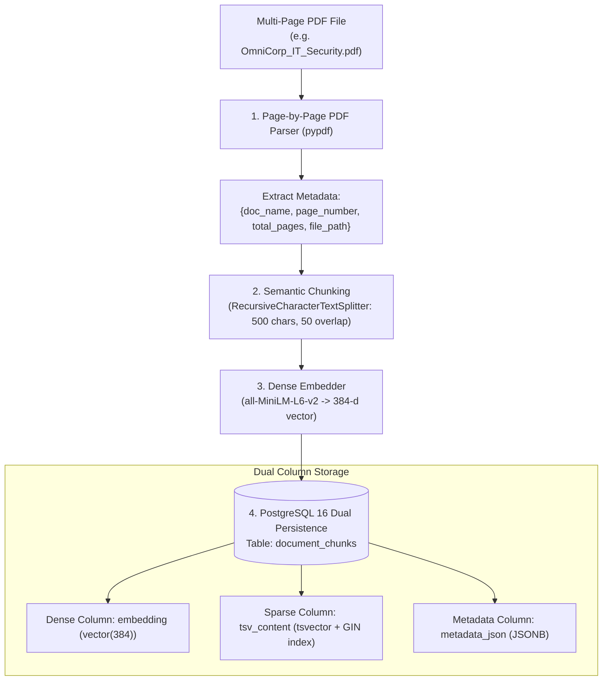

# 12. Concept Deep-Dive: Enterprise PDF Ingestion & Dual Indexing

---

## 1. Why Naive Ingestion Fails in Production

Many naive tutorial RAG scripts simply read a `.txt` file, dump it into a basic vector store, and throw away all page numbers and metadata.

In real-world enterprise deployments, this causes 3 severe problems:
1. **Broken Citations:** The LLM cannot tell the user *which document* or *which page* the answer came from.
2. **Context Fragmentation:** If chunks are split blindly across sentences, half of a critical paragraph gets cut off.
3. **Single-Index Fragility:** If only dense vectors are stored, you cannot perform exact keyword searches or SQL filtering.

**OmniQuery-AI** solves this with a **Dual-Index Enterprise Ingestion Pipeline**:



---

## 2. Step 1: Page-by-Page Extraction & Metadata Preservation

In [`app/rag/ingest.py`](file:///Users/jnarayanassamy/personal/ai/canishe/OmniQuery-AI/app/rag/ingest.py#L35-L60), we extract text per page and attach page metadata:

```python
from pypdf import PdfReader

def load_pdf(file_path: str):
    reader = PdfReader(file_path)
    doc_name = os.path.basename(file_path)
    pages_data = []

    for idx, page in enumerate(reader.pages):
        page_text = page.extract_text() or ""
        if page_text.strip():
            pages_data.append({
                "content": page_text.strip(),
                "metadata": {
                    "document_name": doc_name,
                    "document_id": doc_name.replace(" ", "_").lower(),
                    "page_number": idx + 1,
                    "total_pages": len(reader.pages),
                    "source": file_path
                }
            })
    return pages_data
```

---

## 3. Step 2: Semantic Chunking with Overlap

Why do we use `chunk_size=500` and `chunk_overlap=50`?
* **Chunk Size (500 chars $\approx$ 100 words):** Fits a single coherent idea or policy paragraph without diluting the semantic vector.
* **Chunk Overlap (50 chars $\approx$ 10 words):** Ensures that sentences spanning across a chunk boundary are not severed in the middle of a thought.
* **Hierarchical Separators:** `["\n\n", "\n", ". ", " ", ""]` guarantees splits happen naturally at paragraphs or sentence endings before splitting words.

---

## 4. Step 3: Dual Storage in PostgreSQL (`pgvector` + `tsvector`)

In [`app/models.py`](file:///Users/jnarayanassamy/personal/ai/canishe/OmniQuery-AI/app/models.py#L22-L55), every chunk is stored with both representations:

```sql
CREATE TABLE document_chunks (
    id SERIAL PRIMARY KEY,
    document_id VARCHAR(255) NOT NULL,
    document_name VARCHAR(255) NOT NULL,
    chunk_index INTEGER NOT NULL,
    content TEXT NOT NULL,
    
    -- 1. Dense Vector (384-dimensional)
    embedding vector(384),
    
    -- 2. Sparse Full-Text Search TSVECTOR
    tsv_content tsvector,
    
    -- 3. Rich JSONB Metadata (page #, source, department)
    metadata_json JSONB,
    created_at TIMESTAMPTZ DEFAULT NOW()
);

-- Fast GIN index for BM25 full text search
CREATE INDEX ix_document_chunks_tsv ON document_chunks USING gin(tsv_content);
```

### Automatic TSVECTOR Generation during Ingestion:
When inserting chunks in [`app/rag/ingest.py`](file:///Users/jnarayanassamy/personal/ai/canishe/OmniQuery-AI/app/rag/ingest.py#L114-L149), PostgreSQL automatically generates the stemmed keywords:

```sql
INSERT INTO document_chunks (
    document_id, document_name, chunk_index, content, embedding, tsv_content, metadata_json
) VALUES (
    :doc_id, :doc_name, :chunk_idx, :content,
    :embedding::vector,
    to_tsvector('english', :content),
    CAST(:metadata_json AS jsonb)
);
```

---

## 5. Summary: Why Dual Indexing Outperforms Standard Vector DBs

| Feature | Standard Vector DB (e.g. Pinecone/Chroma) | OmniQuery-AI Dual Index (pgvector + tsvector) |
| :--- | :--- | :--- |
| **Semantic Search** | ✅ Supported | ✅ Supported via `pgvector` Cosine Distance |
| **Exact Token / SKU Search** | ❌ Poor (Alphanumeric compression) | ✅ Instant via PostgreSQL `tsvector` + GIN |
| **Citations & Page Numbers** | ⚠️ Often discarded | ✅ Preserved in JSONB per chunk |
| **Single Source of Truth** | ❌ Needs separate database + vector DB | ✅ Relational SQL + Vector in ONE PostgreSQL container |
| **Cost** | 💸 High cloud SaaS fees | 🆓 100% Open-Source & Self-Hosted |
