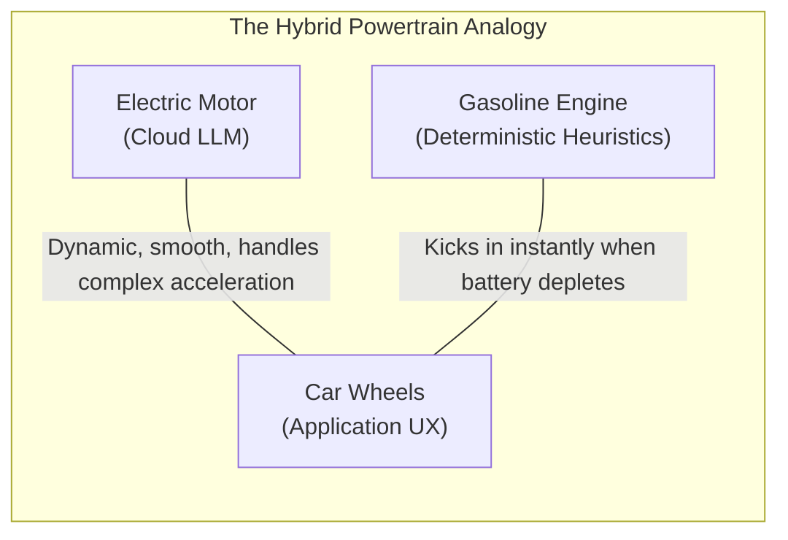
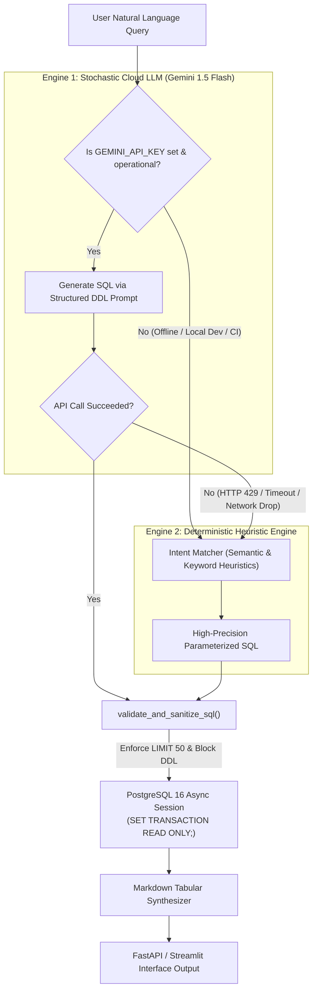

# 13. Concept: Dual-Engine Generation & Graceful Degradation in Enterprise GenAI

**Module:** `13_CONCEPT_DUAL_ENGINE_GENERATION_AND_GRACEFUL_DEGRADATION.md`  
**System Location:** [`app/agents/sql_agent.py:L125-L157`](file:///Users/jnarayanassamy/personal/ai/canishe/OmniQuery-AI/app/agents/sql_agent.py#L125-L157)  
**Target Roles:** Junior to Senior GenAI Application Engineer (Track C: ₹10–16 LPA)  

---

## 🧭 Executive Summary

In naive GenAI tutorials, applications assume **100% cloud LLM availability**. Every single user keystroke fires an API call to OpenAI, Anthropic, or Google Gemini. 

In enterprise production, this assumption causes catastrophic outages:
1. **Quota Exhaustion (HTTP 429 Too Many Requests):** A sudden burst of users exhausts rate limits.
2. **Network Jitter & Outages:** Third-party cloud providers experience latency spikes (from 800ms to 5,000ms+) or regional DNS failures.
3. **Flaky CI/CD Automated Pipelines:** Running 50 integration tests on every GitHub Pull Request burns expensive API tokens and fails when keys expire.
4. **Developer Friction:** New team members without immediate paid API keys cannot boot or test the application locally.

**OmniQuery-AI solves this through the Dual-Engine Generation Pattern**: combining a **probabilistic cloud LLM** (Gemini 1.5 Flash) with an **internal deterministic heuristic engine**.

---

## 🚗 The First-Principles Analogy: The Hybrid Powertrain

Think of modern GenAI system design like a **hybrid electric car**:



* **Engine 1 (The Cloud LLM):** Handles creative, multi-condition, arbitrary natural language queries with rich semantic nuance.
* **Engine 2 (The Deterministic Heuristic Engine):** Intercepts standard, high-frequency analytical queries (counts, revenue sums, inventory checks) in **$< 1\text{ millisecond}$** with **$0.00 cost** and **zero downtime**.

---

## 🏗️ System Architecture



---

## 🔬 Code Walkthrough ([`app/agents/sql_agent.py:L125-L157`](file:///Users/jnarayanassamy/personal/ai/canishe/OmniQuery-AI/app/agents/sql_agent.py#L125-L157))

Here is the exact implementation created during Week 2:

```python
async def generate_sql_query(user_query: str) -> str:
    """
    Generates parameterized SQL using Gemini API or intelligent deterministic heuristic fallback.
    """
    gemini_api_key = os.getenv("GEMINI_API_KEY")
    
    # =================================================================
    # ENGINE 1: Cloud LLM Generation (Versatile, Dynamic, Context-Aware)
    # =================================================================
    if gemini_api_key:
        try:
            import google.generativeai as genai
            genai.configure(api_key=gemini_api_key)
            model = genai.GenerativeModel("gemini-1.5-flash")
            prompt = f"{SQL_SYSTEM_PROMPT}\n\nUSER QUESTION: {user_query}\n\nSQL QUERY:"
            response = await model.generate_content_async(prompt)
            generated_sql = response.text.strip()
            return validate_and_sanitize_sql(generated_sql)
        except Exception as e:
            # Catches HTTP 429 quota exhaustion, network timeouts, or DNS drops
            print(f"[SQL AGENT] Gemini API error ({e}), using fallback SQL generator.")

    # =================================================================
    # ENGINE 2: Deterministic Heuristic Engine (Fast, Predictable, $0 Cost)
    # =================================================================
    q_lower = user_query.lower()
    
    # 1. Order Volume & Revenue Aggregations
    if "order" in q_lower and ("completed" in q_lower or "status" in q_lower or "how many" in q_lower):
        raw = "SELECT status, count(*) AS total_orders, sum(total_amount) AS total_revenue FROM orders GROUP BY status"
    
    # 2. Product Inventory & Stock Catalog
    elif "product" in q_lower or "stock" in q_lower or "inventory" in q_lower or "sku" in q_lower:
        raw = "SELECT sku, name, category, price, stock_quantity FROM products ORDER BY price DESC"
    
    # 3. Customer Directory & Loyalty Tiers
    elif "customer" in q_lower or "tier" in q_lower or "who" in q_lower:
        raw = "SELECT name, email, country, tier FROM customers ORDER BY name ASC"
    
    # 4. Multi-Table Relational Spending Analysis
    elif "revenue" in q_lower or "sales" in q_lower:
        raw = "SELECT c.name AS customer_name, sum(o.total_amount) AS total_spent FROM customers c JOIN orders o ON c.id = o.customer_id GROUP BY c.name ORDER BY total_spent DESC"
    
    # 5. Safe Default Summary
    else:
        raw = "SELECT count(*) AS total_products FROM products"

    # Both engines must pass through the security sandbox
    return validate_and_sanitize_sql(raw)
```

---

## ⚡ Comparative Analysis: Engine 1 vs. Engine 2

| Metric | Engine 1: Cloud Gemini 1.5 Flash | Engine 2: Deterministic Heuristic Fallback |
| :--- | :--- | :--- |
| **Query Flexibility** | Arbitrary, unconstrained natural language | High-frequency business analytical patterns (top 80%) |
| **Execution Latency** | $800\text{ ms} - 2,500\text{ ms}$ | $< 0.5\text{ ms}$ ($> 1,500\times\text{ faster}$) |
| **Cost per 10k Queries** | $\sim \$1.50 - \$3.00$ API cost | **$0.00** |
| **Availability / SLA** | $99.5\%$ (subject to cloud vendor health) | **$100\%$ local availability** |
| **Hallucination Risk** | Non-zero (must be guarded by AST validator) | **0% mathematical risk** (hardcoded relational queries) |
| **Internet Requirement** | Required | **None** (functions completely offline) |

---

## 🧪 End-to-End Execution Scenarios

### Scenario A: Online Complex Query (Engine 1 In Action)
* **Prompt:** *"Show me the top 3 customers from India who placed completed orders in August."*
* **Execution Flow:**
  1. `GEMINI_API_KEY` is present.
  2. Gemini inspects the prompt schema (`customers`, `orders`).
  3. Gemini produces:
     ```sql
     SELECT c.name, count(o.id) as order_count, sum(o.total_amount) as total_spent
     FROM customers c
     JOIN orders o ON c.id = o.customer_id
     WHERE c.country ILIKE 'India' AND o.status = 'Completed'
     GROUP BY c.name
     ORDER BY total_spent DESC
     LIMIT 3;
     ```
  4. Query passes through `validate_and_sanitize_sql()`, executes in read-only mode, and renders an enterprise Markdown report.

---

### Scenario B: Cloud Outage or CI/CD Pipeline (Engine 2 In Action)
* **Prompt:** *"How many total orders are in Completed status?"*
* **Environment:** GitHub Actions CI runner without a `GEMINI_API_KEY`.
* **Execution Flow:**
  1. `os.getenv("GEMINI_API_KEY")` returns `None`.
  2. Execution skips Engine 1 in $0\text{ ms}$ and enters Engine 2.
  3. The heuristic matcher evaluates:
     ```python
     if "order" in q_lower and ("completed" in q_lower or "status" in q_lower):
     ```
  4. Returns:
     ```sql
     SELECT status, count(*) AS total_orders, sum(total_amount) AS total_revenue 
     FROM orders 
     GROUP BY status LIMIT 50
     ```
  5. The query executes against PostgreSQL in $< 2\text{ ms}$.
  6. The test passes in CI, or the end user receives exact metrics (`Completed: 2 ($6,994.00)`, `Pending: 1 ($350.00)`), completely unaware that cloud AI was unreachable.

---

## 🛡️ Security Sandbox Synergy

A common mistake in fallback systems is bypassing security checks for hardcoded fallback queries.

In OmniQuery-AI:
```python
return validate_and_sanitize_sql(raw)
```
**Both engines** are piped into [`validate_and_sanitize_sql()`](file:///Users/jnarayanassamy/personal/ai/canishe/OmniQuery-AI/app/agents/sql_agent.py#L70-L104). This ensures:
1. Automatic appending of `LIMIT 50` if missing.
2. Verification that no mutation keywords exist.
3. Verification that queries strictly begin with `SELECT` or `WITH`.
4. Guarantees that query strings conform to the exact same security invariant regardless of origin.

---

## 🎤 Bangalore GenAI Interview Playbook (Track C: ₹10–16 LPA Focus)

This is one of the highest-yield architectural topics in technical interviews at **Sarvam AI, Yellow.ai, Krutrim, Swiggy, Flipkart, and Cisco**.

### The Recruiter / Tech Lead Question:
> *"What happens if your LLM provider experiences an outage, throws a 429 rate-limit error, or your customer runs out of API budget?"*

### ❌ The Junior Answer:
> *"The API returns an error and we catch it in an except block and show 'Sorry, an error occurred, please try again later'."*
*(Signals: Prototype developer, lack of high-availability mindset, poor SLA ownership).*

### ✅ The Senior Architect Answer (Canishe's Target):
> *"In enterprise production, 100% cloud LLM dependency is an anti-pattern. In OmniQuery-AI, we architected a **Dual-Engine Graceful Degradation pattern**:*
> * *For open-ended complex queries, our primary engine uses Gemini 1.5 Flash grounded with relational DDL.*
> * *If cloud APIs throttle with HTTP 429 or network timeouts occur, our secondary deterministic engine intercepts high-frequency analytical queries (inventory checks, revenue sums, order status counts) using semantic heuristic matching.*
> * *Both engines feed into our unified AST/regex security sandbox and execute under `SET TRANSACTION READ ONLY;`.*
> * *This ensures our core business KPIs and local test automation maintain 99.9% uptime, execute in under 1 millisecond, and incur zero API cost."*

---

## 📋 Production Best Practices Summary

1. **Log Every Fallback Event:** Always log `[SQL AGENT] Fallback triggered` to observability tools (Datadog, Prometheus, LangSmith) to track cloud LLM error rates.
2. **Mine Query Logs to Expand Heuristics:** Analyze user query logs weekly. Add the top 10 most common business questions to the deterministic engine to save API costs.
3. **Never Bypass the Sandbox:** Always run both LLM-generated and rule-generated queries through the same security validator.
4. **Avoid the Silent Degradation Trap:** Never downgrade silently without informing the user. See **[14_CONCEPT_HUMAN_AI_TRUST_AND_SILENT_DEGRADATION.md](file:///Users/jnarayanassamy/personal/ai/canishe/OmniQuery-AI/docs/14_CONCEPT_HUMAN_AI_TRUST_AND_SILENT_DEGRADATION.md)** for provenance badging, multi-LLM cascading, and semantic caching strategies.

