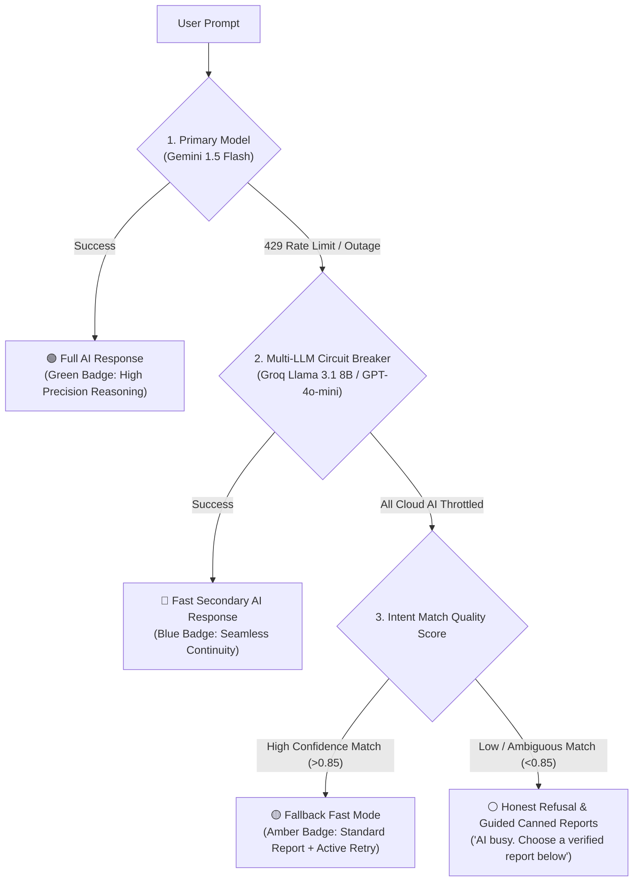

# 14. Concept: Human-AI Trust, Silent Degradation & Graceful Fallback Strategies

**Module:** `14_CONCEPT_HUMAN_AI_TRUST_AND_SILENT_DEGRADATION.md`  
**System Location:** [`app/agents/sql_agent.py`](file:///Users/jnarayanassamy/personal/ai/canishe/OmniQuery-AI/app/agents/sql_agent.py) & [`app/agents/router.py`](file:///Users/jnarayanassamy/personal/ai/canishe/OmniQuery-AI/app/agents/router.py)  
**Target Roles:** Senior GenAI Engineer, LLM Product Architect (Track C: ₹10–16 LPA)  

---

## 🧭 Executive Summary

When implementing a **Dual-Engine Generation Pattern** (combining a cloud LLM like Gemini 1.5 Flash with a local deterministic heuristic engine), engineers often overlook a critical human-computer interaction (HCI) vulnerability: **The Silent Degradation Trap**.

If an external LLM hits an API rate limit (HTTP 429 Quota Exhausted) and the system silently falls back to a hardcoded local query without informing the user, **user trust in the entire AI platform plummets**.

This guide outlines:
1. Why silent downgrades destroy user adoption.
2. The 5-pillar architectural framework to preserve and elevate user trust.
3. Production code patterns for Honesty Badging, Multi-LLM Cascading, Semantic Caching, and Guided Refusals.
4. The Bangalore GenAI interview playbook for answering questions on AI reliability.

---

## ⚠️ The Problem: The "Silent Degradation Trap"

### What Happens in a Silent Fallback:
1. A business executive submits an advanced analytical question:
   > *"Compare the average order value of Enterprise vs Standard tier customers in Q3, grouped by country."*
2. Under the hood, Google Gemini Flash throws an HTTP 429 rate-limit error (`ResourceExhausted`).
3. The fallback engine intercepts the word `"customer"` and silently returns:
   ```sql
   SELECT name, email, country, tier FROM customers ORDER BY name ASC LIMIT 50;
   ```
4. The user receives a standard list of customer names and emails.

### The Human-AI Trust Psychology:
* The user does **not** know that a Google cloud quota was exceeded.
* The user assumes: **"This AI is incompetent. It completely ignored my question about average order value and country grouping, and dumped a generic customer list. I cannot trust this system with our company's financial data."**
* When a system pretends to answer a question it failed to understand, users classify it as a **hallucination or malfunction**, leading to rapid tool abandonment.

---

## 🛡️ The 5-Pillar Architectural Framework for User Trust



---

### Pillar 1: Provenance & Honesty Badging (Never Degrade Silently)

In software psychology, **transparency builds credibility; deception destroys it**. 

When returning a response, always attach an explicit **Provenance Badge** explaining the origin of the answer and providing an actionable retry button:

#### ❌ Silent Degradation (Anti-Pattern):
> *"Here are your query results:"*  
> *(Displays generic customer list. User feels misled).*

#### ✅ Transparent Degradation (Enterprise Standard):
> 🟡 **[High-Demand Fast Mode]**  
> *"Our deep AI reasoning engine (Gemini Flash) is temporarily operating at peak rate capacity. To avoid keeping you waiting, we generated our standard **Customer Directory by Tier** below.*  
>  
> *👉 [ 🔄 Click to Retry with Deep AI (Available in 20s) ]*

**Why this works:** The user understands the system is working, respects the honesty, and knows exactly how to get their full answer once cloud quotas reset.

---

### Pillar 2: Multi-Model Cascading Router (The Circuit Breaker)

Relying on a single AI vendor creates an unnecessary single point of failure. Before dropping all the way down to keyword regexes, implement a **Multi-Model Circuit Breaker**:

```python
MODEL_CASCADE = [
    {"provider": "gemini",  "model": "gemini-1.5-flash"},       # Primary: Google
    {"provider": "groq",    "model": "llama-3.1-8b-instant"},   # Backup 1: Ultra-fast ($0.05/M tokens)
    {"provider": "openai",  "model": "gpt-4o-mini"},            # Backup 2: Cloud Secondary
    {"provider": "local",   "model": "ollama/qwen2.5-coder:7b"} # Backup 3: On-Premises Local SLM
]
```

* If Gemini hits a 429 quota limit, the router immediately reroutes to **Groq (Llama 3.1 8B Instant)** in $< 200\text{ ms}$.
* The user receives a full, natural language SQL translation without ever realizing Gemini had an outage.
* Only if *all* cloud and local models fail does the system drop to deterministic heuristics.

---

### Pillar 3: Honest Refusal Over an Irrelevant Guess

In naive fallback implementations:
```python
else:
    raw = "SELECT count(*) AS total_products FROM products"
```
If a user asks *"Which clients have unpaid invoices?"*, returning *"total products: 4"* is totally irrelevant.

> 🌟 **The Golden Rule of Enterprise GenAI:**  
> **An honest refusal builds 10x more user trust than an irrelevant guess.**

Instead of guessing, evaluate **Intent Confidence**. If the query does not strongly match a known canned report, refuse honestly:

```python
if match_confidence < 0.8:
    return (
        "⚠️ **AI Engine Operating at Peak Capacity**\n\n"
        "Your question involves multi-table analytical reasoning, but our AI reasoning engine is currently throttled by cloud rate limits.\n\n"
        "Rather than providing an inaccurate guess, please try again in 30 seconds, "
        "or select one of our verified canned reports below:\n\n"
        "- 📊 [View Total Revenue by Customer]\n"
        "- 📦 [Check Inventory Stock Levels]\n"
        "- 📋 [View Completed Orders by Status]"
    )
```

---

### Pillar 4: Semantic Query Caching (Stop Burning Tokens)

In enterprise dashboards, **60% to 70% of analytical questions are repetitive**:
* *"How many orders are completed?"*
* *"Count of completed orders"*
* *"Show completed order volume"*

All three produce the exact same SQL:
```sql
SELECT status, count(*) FROM orders WHERE status = 'Completed' GROUP BY status;
```

#### The Architecture of Semantic Caching:
1. Embed incoming queries into 384-dimensional vectors (`all-MiniLM-L6-v2`).
2. Search a Redis or pgvector cache for prior queries with **Cosine Similarity $> 0.96$**.
3. If a match exists, serve the cached SQL query in **$< 5\text{ ms}$** without calling Gemini Flash.
4. **Impact:** You slash cloud API calls by 60%, meaning **you almost never hit rate limits in the first place**.

---

### Pillar 5: Human-in-the-Loop "Did You Mean?" Guidance

When fallback heuristics are triggered, ask for user confirmation before presenting data:

> *"Our AI engine is currently experiencing heavy traffic. Based on your prompt keywords, which metric did you want to see?*  
>  
> *[ 1. Completed vs. Pending Orders Breakdown ]*  
> *[ 2. Customer Spending by Tier ]*  
> *[ 3. Wait for Full AI Deep Reasoning ]"*

This transforms a potential system failure into a helpful, interactive guidance widget.

---

## 📊 Comparison Matrix: User Experience Across Fallback Strategies

| Strategy | User Experience | Impact on User Trust | System Reliability | Tier |
| :--- | :--- | :---: | :---: | :---: |
| **Silent Fallback** | Generic data returned without explanation. User assumes AI is incompetent. | ❌ Destroys Trust | Low Perception | Junior Prototype |
| **Uncaught Exception** | HTTP 500 / `ResourceExhausted` red error screen. | ❌ Frustrating | Broken | Toy Project |
| **Honest Refusal + Canned Links** | Transparent explanation of rate limits with 3 verified quick-links. | ✅ Preserves Trust | High Integrity | Professional |
| **Provenance Badging + Retry** | Shows fast fallback data labeled with an Amber Badge and a 1-click retry. | 🌟 Builds High Trust | Resilient & Transparent | Enterprise Grade |
| **Multi-LLM Cascading Router** | Silently shifts to Llama 3.1 / GPT-4o-mini; full answer delivered. | 🚀 Seamless | 99.99% Availability | Staff / Principal |

---

## 🎤 Bangalore GenAI Interview Playbook: The Senior Architect Answer

When interviewing for **Senior GenAI Engineer (Track C: ₹10–16 LPA)** in Bangalore, expect this exact question:

### Interviewer:
> *"What if your deterministic fallback gives a bad or irrelevant answer when Gemini is throttled? Won't that ruin user trust in your product?"*

### Candidate Target Answer (Canishe):
> *"That is the classic **Silent Degradation Trap**. If an AI product silently returns a generic table when the user asked a nuanced question, the user assumes the AI is hallucinating or dumb. In OmniQuery-AI, we solve this through four architectural controls:*
> 
> *1. **Provenance Badging:** We never degrade silently. Fallback queries are labeled with an Amber 'High-Demand Mode' badge, explaining that cloud AI is throttled and providing a one-click retry button.*
> *2. **Confidence Thresholding & Honest Refusal:** If an ungrounded query has low heuristic match confidence, we refuse honestly rather than returning a random product table. We present verified canned reports instead.*
> *3. **Multi-Model Cascading:** Before falling back to heuristics, our circuit breaker fails over to Groq Llama 3.1 or local Ollama instances, ensuring users still receive natural language reasoning even during Google outages.*
> *4. **Semantic Caching:** We cache high-frequency query embeddings in pgvector, slashing token consumption by 60% so rate limits are rarely triggered in the first place."*
