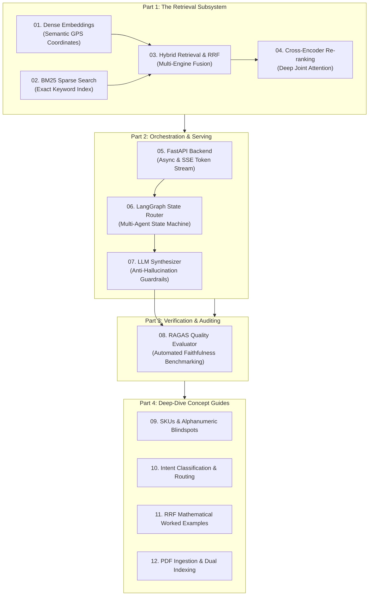

# 📚 OmniQuery-AI: Zero-to-One AI Engineering Curriculum

Welcome to the foundational knowledge base for **OmniQuery-AI**. This series breaks down every core concept from first principles with real-world analogies, mathematical intuition, architecture diagrams, and Python implementations.

---

## 🧭 Master Learning Map

---

## 📑 Core Concept Modules

| Module | Title | Analogy / Summary | File Link |
| :---: | :--- | :--- | :--- |
| **01** | **Dense Embeddings** | *GPS coordinates for ideas.* Converts text into 384-d vectors to understand synonyms and semantic meaning. | [01_DENSE_EMBEDDINGS.md](file:///Users/jnarayanassamy/personal/ai/canishe/OmniQuery-AI/docs/01_DENSE_EMBEDDINGS.md) |
| **02** | **BM25 Sparse Search** | *The textbook index.* Inverted index algorithm for exact matches (error codes, SKUs, clause numbers). | [02_BM25_SPARSE_SEARCH.md](file:///Users/jnarayanassamy/personal/ai/canishe/OmniQuery-AI/docs/02_BM25_SPARSE_SEARCH.md) |
| **03** | **Hybrid Retrieval & RRF** | *Two specialized detectives.* Merging dense and sparse results using Reciprocal Rank Fusion ($k=60$). | [03_HYBRID_RETRIEVAL_AND_RRF.md](file:///Users/jnarayanassamy/personal/ai/canishe/OmniQuery-AI/docs/03_HYBRID_RETRIEVAL_AND_RRF.md) |
| **04** | **Cross-Encoder Re-ranker** | *Speed dating vs. In-depth interview.* Deep joint attention (`FlashRank`) to filter noise and pass only top chunks to the LLM. | [04_CROSS_ENCODER_RERANKER.md](file:///Users/jnarayanassamy/personal/ai/canishe/OmniQuery-AI/docs/04_CROSS_ENCODER_RERANKER.md) |
| **05** | **FastAPI Backend** | *High-throughput order counter.* Non-blocking async REST and Server-Sent Events (SSE) token streaming. | [05_FASTAPI_BACKEND.md](file:///Users/jnarayanassamy/personal/ai/canishe/OmniQuery-AI/docs/05_FASTAPI_BACKEND.md) |
| **06** | **LangGraph State Router** | *Hospital triage reception.* Multi-agent state machine routing dynamically between Document RAG, Text-to-SQL, and Chat. | [06_LANGGRAPH_STATE_ROUTER.md](file:///Users/jnarayanassamy/personal/ai/canishe/OmniQuery-AI/docs/06_LANGGRAPH_STATE_ROUTER.md) |
| **07** | **LLM Synthesizer** | *The executive briefing memo.* Grounded answer generation with strict anti-hallucination prompt guardrails. | [07_LLM_SYNTHESIZER.md](file:///Users/jnarayanassamy/personal/ai/canishe/OmniQuery-AI/docs/07_LLM_SYNTHESIZER.md) |
| **08** | **RAGAS Quality Evaluator** | *Automated crash-testing track.* Measuring mathematical Faithfulness (>90%), Answer Relevance, and Context Precision. | [08_RAGAS_QUALITY_EVALUATOR.md](file:///Users/jnarayanassamy/personal/ai/canishe/OmniQuery-AI/docs/08_RAGAS_QUALITY_EVALUATOR.md) |

---

## 🔬 In-Depth Concept Learning Guides (Created Today)

| Guide | Focus Concept | Key Learnings & Interview Answers | File Link |
| :---: | :--- | :--- | :--- |
| **09** | **SKUs & The Alphanumeric Blindspot in AI** | Why vector models confuse `SKU-4001` with `SKU-4002` (0.98 similarity), and how BM25 + SQL eliminates catalog hallucinations. | [09_CONCEPT_SKUS_AND_ALPHANUMERIC_BLINDSPOTS.md](file:///Users/jnarayanassamy/personal/ai/canishe/OmniQuery-AI/docs/09_CONCEPT_SKUS_AND_ALPHANUMERIC_BLINDSPOTS.md) |
| **10** | **Intent Classification & Dynamic Routing** | How LangGraph routers decide between RAG and SQL using Keyword Heuristics, Semantic Vector Anchors, and Structured LLM JSON schemas. | [10_CONCEPT_INTENT_CLASSIFICATION_AND_ROUTING.md](file:///Users/jnarayanassamy/personal/ai/canishe/OmniQuery-AI/docs/10_CONCEPT_INTENT_CLASSIFICATION_AND_ROUTING.md) |
| **11** | **RRF Math & Worked Examples** | Why raw scores cannot be added, mathematical derivation of $\frac{1}{k+\text{rank}}$, why $k=60$ works, and a 4-document numerical walkthrough. | [11_CONCEPT_RECIPROCAL_RANK_FUSION_WORKED_EXAMPLES.md](file:///Users/jnarayanassamy/personal/ai/canishe/OmniQuery-AI/docs/11_CONCEPT_RECIPROCAL_RANK_FUSION_WORKED_EXAMPLES.md) |
| **12** | **Enterprise PDF Ingestion & Dual Indexing** | Page-by-page parsing, 500/50 token chunking, 384-d `all-MiniLM-L6-v2` embeddings, and dual `vector(384)` + `tsvector` PostgreSQL storage. | [12_CONCEPT_PDF_INGESTION_AND_DUAL_INDEXING.md](file:///Users/jnarayanassamy/personal/ai/canishe/OmniQuery-AI/docs/12_CONCEPT_PDF_INGESTION_AND_DUAL_INDEXING.md) |
| **13** | **Dual-Engine Generation & Graceful Degradation** | Combining stochastic LLMs (Gemini 1.5 Flash) with deterministic heuristics for 99.9% uptime, $0.00 test automation, and zero vendor lock-in. | [13_CONCEPT_DUAL_ENGINE_GENERATION_AND_GRACEFUL_DEGRADATION.md](file:///Users/jnarayanassamy/personal/ai/canishe/OmniQuery-AI/docs/13_CONCEPT_DUAL_ENGINE_GENERATION_AND_GRACEFUL_DEGRADATION.md) |
| **14** | **Human-AI Trust & Silent Degradation** | Avoiding the silent degradation trap: Provenance Badging, Multi-Model Circuit Breakers (Groq Llama 3.1), Semantic Caching, and Guided Refusals. | [14_CONCEPT_HUMAN_AI_TRUST_AND_SILENT_DEGRADATION.md](file:///Users/jnarayanassamy/personal/ai/canishe/OmniQuery-AI/docs/14_CONCEPT_HUMAN_AI_TRUST_AND_SILENT_DEGRADATION.md) |

---

## 🎯 High-Level Architecture, Retrospectives & Reviews

* **RAGAS Benchmark Quality Scorecard:** [RAGAS_BENCHMARK_SCORECARD.md](file:///C:/Users/DELL/Personal/Projects/OmniQuery-AI/docs/RAGAS_BENCHMARK_SCORECARD.md)
* **Master GenAI Interview Question Bank:** [INTERVIEW_QUESTION_BANK.md](file:///C:/Users/DELL/Personal/Projects/OmniQuery-AI/docs/INTERVIEW_QUESTION_BANK.md)
* **Canishe's Week 3 Action Plan (RAGAS Evaluation):** [CANISHE_ACTION_PLAN_WEEK_3_RAGAS_EVALUATION.md](file:///C:/Users/DELL/Personal/Projects/OmniQuery-AI/CANISHE_ACTION_PLAN_WEEK_3_RAGAS_EVALUATION.md)
* **Canishe's Week 2 Retrospective & AGY Mastery Guide:** [CANISHE_WEEK_2_RETROSPECTIVE_AND_AGY_MASTERY_GUIDE.md](file:///Users/jnarayanassamy/personal/ai/canishe/OmniQuery-AI/CANISHE_WEEK_2_RETROSPECTIVE_AND_AGY_MASTERY_GUIDE.md)
* **Architect Review: Negative & Edge Testing:** [ARCHITECT_REVIEW_NEGATIVE_AND_EDGE_TESTING.md](file:///Users/jnarayanassamy/personal/ai/canishe/OmniQuery-AI/review_comments/ARCHITECT_REVIEW_NEGATIVE_AND_EDGE_TESTING.md)
* **Architect Review: Text-to-SQL Copilot Engine:** [ARCHITECT_REVIEW_TEXT_TO_SQL_COPILOT.md](file:///Users/jnarayanassamy/personal/ai/canishe/OmniQuery-AI/review_comments/ARCHITECT_REVIEW_TEXT_TO_SQL_COPILOT.md)
* **Project Requirements & Architecture:** [PROJECT_REQUIREMENTS_AND_ARCHITECTURE.md](file:///Users/jnarayanassamy/personal/ai/canishe/OmniQuery-AI/PROJECT_REQUIREMENTS_AND_ARCHITECTURE.md)
* **Real-World Use Cases & Target State:** [REAL_WORLD_USE_CASES_AND_TARGET_STATE.md](file:///Users/jnarayanassamy/personal/ai/canishe/OmniQuery-AI/REAL_WORLD_USE_CASES_AND_TARGET_STATE.md)
* **Recommended Learning Resources:** [RECOMMENDED_LEARNING_RESOURCES.md](file:///Users/jnarayanassamy/personal/ai/canishe/OmniQuery-AI/docs/RECOMMENDED_LEARNING_RESOURCES.md)

