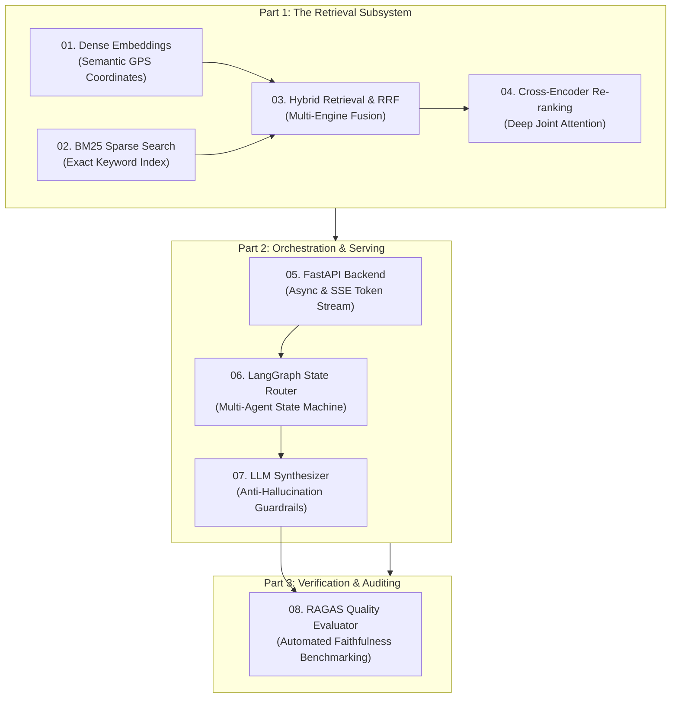

# 📚 OmniQuery-AI: Zero-to-One AI Engineering Curriculum

Welcome to the foundational knowledge base for **OmniQuery-AI**. This series breaks down every core concept from first principles with real-world analogies, mathematical intuition, architecture diagrams, and Python implementations.

---

## 🧭 Master Learning Map

---

## 📑 Core Concept Modules

| Module | Title | Analogy / Summary | File Link |
| :---: | :--- | :--- | :--- |
| **01** | **Dense Embeddings** | *GPS coordinates for ideas.* Converts text into 384-d vectors to understand synonyms and semantic meaning. | [01_DENSE_EMBEDDINGS.md](file:///Users/jnarayanassamy/personal/ai/canishe/OmniQuery-AI/docs/01_DENSE_EMBEDDINGS.md) |
| **02** | **BM25 Sparse Search** | *The textbook index.* Inverted index algorithm for exact matches (error codes, SKUs, clause numbers). | [02_BM25_SPARSE_SEARCH.md](file:///Users/jnarayanassamy/personal/ai/canishe/OmniQuery-AI/docs/02_BM25_SPARSE_SEARCH.md) |
| **03** | **Hybrid Retrieval & RRF** | *Two specialized detectives.* Merging dense and sparse results using Reciprocal Rank Fusion ($k=60$). | [03_HYBRID_RETRIEVAL_AND_RRF.md](file:///Users/jnarayanassamy/personal/ai/canishe/OmniQuery-AI/docs/03_HYBRID_RETRIEVAL_AND_RRF.md) |
| **04** | **Cross-Encoder Re-ranker** | *Speed dating vs. In-depth interview.* Deep joint attention (`FlashRank`) to filter noise and pass only top chunks to the LLM. | [04_CROSS_ENCODER_RERANKER.md](file:///Users/jnarayanassamy/personal/ai/canishe/OmniQuery-AI/docs/04_CROSS_ENCODER_RERANKER.md) |
| **05** | **FastAPI Backend** | *High-throughput order counter.* Non-blocking async REST and Server-Sent Events (SSE) token streaming. | [05_FASTAPI_BACKEND.md](file:///Users/jnarayanassamy/personal/ai/canishe/OmniQuery-AI/docs/05_FASTAPI_BACKEND.md) |
| **06** | **LangGraph State Router** | *Hospital triage reception.* Multi-agent state machine routing dynamically between Document RAG, Text-to-SQL, and Chat. | [06_LANGGRAPH_STATE_ROUTER.md](file:///Users/jnarayanassamy/personal/ai/canishe/OmniQuery-AI/docs/06_LANGGRAPH_STATE_ROUTER.md) |
| **07** | **LLM Synthesizer** | *The executive briefing memo.* Grounded answer generation with strict anti-hallucination prompt guardrails. | [07_LLM_SYNTHESIZER.md](file:///Users/jnarayanassamy/personal/ai/canishe/OmniQuery-AI/docs/07_LLM_SYNTHESIZER.md) |
| **08** | **RAGAS Quality Evaluator** | *Automated crash-testing track.* Measuring mathematical Faithfulness (>90%), Answer Relevance, and Context Precision. | [08_RAGAS_QUALITY_EVALUATOR.md](file:///Users/jnarayanassamy/personal/ai/canishe/OmniQuery-AI/docs/08_RAGAS_QUALITY_EVALUATOR.md) |

---

## 🎯 High-Level Architecture & Use Cases

* **Project Requirements & Architecture:** [PROJECT_REQUIREMENTS_AND_ARCHITECTURE.md](file:///Users/jnarayanassamy/personal/ai/canishe/OmniQuery-AI/PROJECT_REQUIREMENTS_AND_ARCHITECTURE.md)
* **Real-World Use Cases & Target State:** [REAL_WORLD_USE_CASES_AND_TARGET_STATE.md](file:///Users/jnarayanassamy/personal/ai/canishe/OmniQuery-AI/REAL_WORLD_USE_CASES_AND_TARGET_STATE.md)
