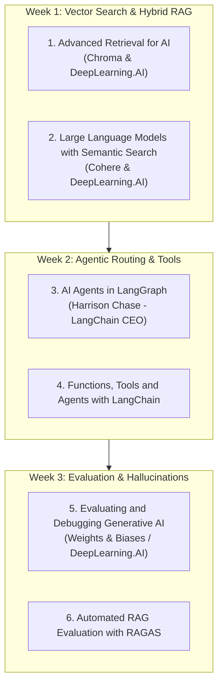

# 🎓 Recommended Learning Path & Theoretical Courses

You **do not** need an expensive $1,000 bootcamp or a 6-month university degree. The GenAI ecosystem evolves so rapidly that the best, most respected learning resources in the industry are **100% FREE, 1-to-2-hour specialized micro-courses** created directly by the inventors of these technologies (Andrew Ng's DeepLearning.AI, LangChain, and Cohere).

Here is the exact curated curriculum to master every concept in **OmniQuery-AI**.

---

## 🏆 Tier 1: The Essential Free Short Courses (DeepLearning.AI)

All of these courses are taught by leading AI pioneers (including Andrew Ng and the creators of LangChain/Chroma), are **completely free to audit**, take **~1 hour each**, and include interactive Jupyter notebook coding environments in your browser.

---

### Course 1: Advanced Retrieval for AI
* **Platform:** DeepLearning.AI
* **Instructor:** Anton Trofimovich (Chroma)
* **Duration:** ~1 Hour | **Cost:** FREE
* **Key Topics Covered:**
  * Dense vector search vs. Sparse keyword search.
  * Query expansion and Cross-Encoder Re-ranking.
  * Embedding fine-tuning and context compression.
* **Link:** [DeepLearning.AI - Advanced Retrieval for AI](https://www.deeplearning.ai/short-courses/advanced-retrieval-for-ai/)

---

### Course 2: Large Language Models with Semantic Search
* **Platform:** DeepLearning.AI & Cohere
* **Instructor:** Jay Alammar & Nils Reimers (Creator of `sentence-transformers`)
* **Duration:** ~1 Hour | **Cost:** FREE
* **Key Topics Covered:**
  * How Transformer embeddings calculate semantic distance.
  * Dense Retrieval vs. BM25 Lexical Keyword search.
  * Re-ranking algorithms and Cross-Encoders.
* **Link:** [DeepLearning.AI - Semantic Search](https://www.deeplearning.ai/short-courses/large-language-models-semantic-search/)

---

### Course 3: AI Agents in LangGraph (Official LangChain Course)
* **Platform:** DeepLearning.AI
* **Instructor:** Harrison Chase (CEO & Founder of LangChain) & Rotem Weiss
* **Duration:** ~1 Hour | **Cost:** FREE
* **Key Topics Covered:**
  * Building Agent State Graphs (`StateGraph`, Nodes, Edges).
  * Cyclic agent loops, human-in-the-loop, and memory persistence.
  * Dynamic routing between document search, SQL, and external tools.
* **Link:** [DeepLearning.AI - AI Agents in LangGraph](https://www.deeplearning.ai/short-courses/ai-agents-in-langgraph/)

---

### Course 4: Preprocessing Unstructured Data for LLM Applications
* **Platform:** DeepLearning.AI & Unstructured.io
* **Duration:** ~1 Hour | **Cost:** FREE
* **Key Topics Covered:**
  * Parsing multi-page PDFs, tables, and images.
  * Optimal text chunking strategies (recursive character splitting).
  * Document metadata extraction for database indexing.
* **Link:** [DeepLearning.AI - Preprocessing Unstructured Data](https://www.deeplearning.ai/short-courses/preprocessing-unstructured-data-for-llm-applications/)

---

## 📖 Tier 2: Free Interactive Conceptual Textbooks

If you prefer reading visual, step-by-step interactive articles:

### 1. Cohere LLM University (Visual & Intuitive)
* The most beautifully illustrated guide on embeddings, cross-encoders, and rerankers.
* **Key Modules to read:**
  * *Text Representation with Embeddings*
  * *Similarity & Cosine Distance*
  * *Cross-Encoders & Re-ranking*
* **Link:** [Cohere LLM University](https://cohere.com/llmu)

### 2. Pinecone Learning Center: The RAG & Vector Search Handbook
* Industry-standard articles breaking down Hybrid Search, BM25, and Vector Indexing (HNSW, IVFFlat).
* **Link:** [Pinecone Learning Center](https://www.pinecone.io/learn/)

---

## 📺 Tier 3: Zero-Fluff YouTube Channels (For Quick Visual Explanations)

| Channel | Why You Should Watch It | Recommended Videos |
| :--- | :--- | :--- |
| **StatQuest with Josh Starmer** | Breaks down math into simple cartoon visual intuition with zero jargon. | *Word Embeddings*, *Cosine Similarity*, *Transformer Neural Networks*. |
| **James Briggs** | The best technical YouTube channel on Vector Search, pgvector, BM25, and Hybrid RAG. | *Hybrid Search Explained*, *Cross-Encoder Re-ranking Tutorial*. |
| **LangChain Official** | Fast, 5-minute explainers on LangGraph state machines and Agent routing. | *LangGraph Quickstart*, *Multi-Agent Router Architecture*. |

---

## 🗓️ Suggested 4-Week Study & Build Schedule

| Week | Topic to Learn (1-2 Hours Study) | OmniQuery-AI Code to Build |
| :---: | :--- | :--- |
| **Week 1** | DeepLearning.AI *Advanced Retrieval* + *Semantic Search* | Build PDF chunker (`ingest.py`) & PostgreSQL `pgvector` + `BM25` hybrid search. |
| **Week 2** | DeepLearning.AI *AI Agents in LangGraph* | Build Text-to-SQL agent (`sql_agent.py`) & LangGraph Router (`router.py`). |
| **Week 3** | RAGAS documentation + Cohere Re-ranker guide | Write automated test suite (`ragas_bench.py`) and Streamlit token streaming. |
| **Week 4** | FastAPI Official User Guide (Deployment & Docker) | Multi-container Docker deployment and live showcase on Hugging Face Spaces. |
