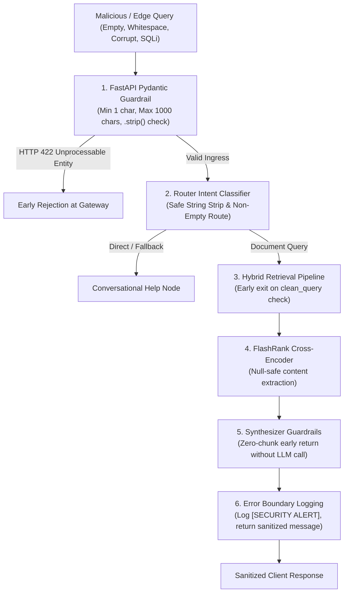

# 🛡️ Senior GenAI Architect Code Review

**Repository:** `OmniQuery-AI`  
**Branch Under Review:** [`feature/negative-and-edge-testing`](file:///Users/jnarayanassamy/personal/ai/canishe/OmniQuery-AI/)  
**Commit:** [`dec76a3`](https://github.com/ccanishe/OmniQuery-AI/commit/dec76a38135397894c074761ec0d4e32dca38c69) (`feat(eval): add comprehensive negative scenario test suite and harden error boundaries`)  
**Author:** Canishe (`ccanishe@gmail.com`)  
**Reviewer:** Senior GenAI & Enterprise AI Architect  
**Review Date:** September 2, 2026  
**Verdict:** **APPROVED WITH COMMENDATION & MINOR REFINEMENTS** 🟢  

---

## 🎯 Executive Verdict

This pull request represents a **critical engineering milestone**: transitioning OmniQuery-AI from a "happy-path" prototype to an **enterprise-resilient, production-hardened system**. 

Canishe systematically identified and addressed failure modes across all core layers of the GenAI stack:
1. **API Ingress Boundary:** Pydantic schema validation preventing buffer and string flooding attacks.
2. **Retrieval Pipeline:** Short-circuiting empty queries before firing expensive dense vector embeddings.
3. **Re-Ranking Layer:** Null-safe text extraction preventing runtime crashes on corrupted document metadata.
4. **Synthesis / LLM Layer:** Pre-generation zero-chunk guardrails eliminating context-less hallucinations.
5. **Observability & Security:** Sanitizing client-facing error messages to prevent internal stack trace and infrastructure leakage.

Below is the comprehensive architectural breakdown, detailing strengths, critical findings, actionable code refinements, and interview talking points.

---

## 🏗️ Architecture & Component Impact Map



---

## 🌟 Architectural Strengths (What Was Done Exceptionally Well)

### 1. Ingress Layer: Hardened Pydantic Guardrails ([`app/main.py`](file:///Users/jnarayanassamy/personal/ai/canishe/OmniQuery-AI/app/main.py#L23-L39))
```python
class QueryRequest(BaseModel):
    query: str = Field(
        ..., 
        min_length=1, 
        max_length=1000, 
        description="The user prompt or question"
    )
    user_id: Optional[str] = Field("default_user", max_length=100)

    @field_validator("query")
    @classmethod
    def validate_query_not_empty(cls, v: str) -> str:
        stripped = v.strip()
        if not stripped:
            raise ValueError("Query string cannot be empty or pure whitespace.")
        return stripped
```
* **Architectural Rationale:** 
  * **Buffer Protection:** Rejecting queries beyond `max_length=1000` prevents token exhaustion attacks and protects embedding models from memory spikes and latency degradation.
  * **Whitespace Bypass Prevention:** Standard `min_length=1` can be bypassed by strings consisting purely of spaces or newlines (`"   "`). The `@field_validator` with `.strip()` guarantees only actionable queries enter the system.
  * **Immediate Rejection:** Yields an immediate HTTP 422 Unprocessable Entity at the FastAPI gateway layer before any compute (embeddings, LangGraph, or DB) is triggered.

---

### 2. Compute Efficiency: Early-Exit Guardrail in Retrieval ([`app/rag/hybrid_retriever.py`](file:///Users/jnarayanassamy/personal/ai/canishe/OmniQuery-AI/app/rag/hybrid_retriever.py#L107-L110))
```python
clean_query = query.strip() if query else ""
if not clean_query:
    return []
```
* **Architectural Rationale:** 
  * In naive retrieval pipelines, an empty query string is still passed to `model.encode("")`, consuming CPU/GPU tensor operations and performing an expensive cosine similarity scan across pgvector.
  * Short-circuiting the retrieval pipeline in $O(1)$ time saves database I/O and server resources.

---

### 3. Fault-Tolerant Re-ranking on Corrupted Metadata ([`app/rag/reranker.py`](file:///Users/jnarayanassamy/personal/ai/canishe/OmniQuery-AI/app/rag/reranker.py#L53-L60))
```python
passages = []
for idx, doc in enumerate(candidates):
    raw_content = doc.get("content")
    text_content = str(raw_content).strip() if raw_content is not None else ""
    passages.append({
        "id": doc.get("id", idx),
        "text": text_content,
        "meta": doc
    })
```
* **Architectural Rationale:** 
  * In real-world enterprise databases, document chunks occasionally have `NULL` or missing `content` fields due to OCR errors, indexing timeouts, or schema migrations.
  * Passing `None` into FlashRank's Cross-Encoder causes an unhandled `TypeError: expected str, got NoneType`. Canishe's safe extraction guarantees the re-ranker will not crash during production joint-attention passes.

---

### 4. Anti-Hallucination Zero-Context Fallback ([`app/rag/synthesizer.py`](file:///Users/jnarayanassamy/personal/ai/canishe/OmniQuery-AI/app/rag/synthesizer.py#L47-L49))
```python
if not chunks:
    return "I could not find any relevant information in the enterprise knowledge base for your query."
```
* **Architectural Rationale:** 
  * Previously, the zero-chunk check occurred *after* attempting to invoke the Gemini API.
  * Moving this check to the top ensures that if retrieval returns 0 candidates, the system does not invoke the LLM with an empty context prompt. This prevents hallucinations, eliminates API cost, and reduces latency.

---

### 5. Security Sanitization of Error Boundaries ([`app/agents/router.py`](file:///Users/jnarayanassamy/personal/ai/canishe/OmniQuery-AI/app/agents/router.py#L73-L81) & [`app/main.py`](file:///Users/jnarayanassamy/personal/ai/canishe/OmniQuery-AI/app/main.py#L72-L77))
```python
except Exception as e:
    # Log error internally for developers/monitoring
    print(f"[SECURITY ALERT] Retrieval exception logged: {e}")
    # Return sanitized response to client
    state["response"] = (
        "⚠️ We encountered a temporary issue searching the enterprise document knowledge base. "
        "Our engineering team has been notified. Please try your query again in a moment."
    )
```
* **Architectural Rationale:** 
  * Leaking raw exception strings (such as `psycopg2.OperationalError: connection to server at "localhost", port 5433 failed`) exposes internal network topologies, hostnames, ports, and table names to malicious actors.
  * Decoupling internal logging from client-facing messages complies with OWASP Top 10 API security best practices.

---

## 🔍 Critical Findings & Senior Architect Refinements

While this pull request is well-crafted, a Lead / Principal Architect would request the following **4 refinements** before production release:

### Finding 1: Substring Collision in Keyword Intent Router
* **Location:** [`app/agents/router.py:L46-L51`](file:///Users/jnarayanassamy/personal/ai/canishe/OmniQuery-AI/app/agents/router.py#L46-L51)
* **Issue:** The intent classifier uses naive Python substring matching:
  ```python
  if any(k in query for k in sql_keywords):
      state["query_type"] = "sql"
  ```
  Because `"from"` was added to `sql_keywords`, a general question like *"Where is the remote work policy document from?"* or *"What is our policy on fromage imports?"* will falsely trigger `sql` intent because `"from"` is an exact substring. Similarly, `"orders"` matches `"disorders"` or `"borders"`.
* **Recommended Code Fix:** Use regex word boundaries or token set intersection:
  ```python
  import re

  def contains_keyword(query: str, keywords: list[str]) -> bool:
      return any(re.search(r"\b" + re.escape(kw) + r"\b", query) for kw in keywords)
  ```

---

### Finding 2: Unhandled Exception in Streaming SSE Endpoint
* **Location:** [`app/main.py:L80-L102`](file:///Users/jnarayanassamy/personal/ai/canishe/OmniQuery-AI/app/main.py#L80-L102)
* **Issue:** In `handle_query` (the synchronous endpoint), Canishe added a clean `try / except Exception` boundary. However, in `stream_query` (the SSE streaming endpoint):
  ```python
  async def token_generator():
      initial_state = {...}
      result = await agent_app.ainvoke(initial_state)  # ⚠️ Unprotected call
  ```
  If `ainvoke` throws an exception here (e.g. database connection drops or network times out), the streaming generator breaks mid-stream, causing the client connection to hang without an explicit error frame.
* **Recommended Code Fix:** Wrap the generator execution and yield an SSE error event:
  ```python
  async def token_generator():
      try:
          result = await agent_app.ainvoke(initial_state)
          response_text = result.get("response", "")
          for word in response_text.split(" "):
              yield f"data: {word} \n\n"
              await asyncio.sleep(0.05)
      except Exception as e:
          print(f"[SECURITY ALERT] Streaming exception: {e}")
          yield "event: error\ndata: ⚠️ An error occurred while generating your response.\n\n"
  ```

---

### Finding 3: Missing Integration Test for FastAPI Pydantic Bounds
* **Location:** [`tests/test_edge_and_negative_cases.py`](file:///Users/jnarayanassamy/personal/ai/canishe/OmniQuery-AI/tests/test_edge_and_negative_cases.py#L1-L11)
* **Issue:** The module docstring explicitly lists:
  > *"7. FastAPI Pydantic schema validation errors"*
  
  However, the test file does not actually test `POST /api/v1/query` with invalid payloads using `TestClient` from `starlette.testclient` or `httpx`.
* **Recommended Code Fix:** Add the missing integration tests:
  ```python
  from fastapi.testclient import TestClient
  from app.main import app

  def test_api_empty_query_returns_422():
      client = TestClient(app)
      res = client.post("/api/v1/query", json={"query": "     "})
      assert res.status_code == 422
      assert "cannot be empty" in res.text

  def test_api_oversized_query_returns_422():
      client = TestClient(app)
      res = client.post("/api/v1/query", json={"query": "A" * 1001})
      assert res.status_code == 422
  ```

---

### Finding 4: Asynchronous Test Ergonomics
* **Location:** [`tests/test_edge_and_negative_cases.py:L91`](file:///Users/jnarayanassamy/personal/ai/canishe/OmniQuery-AI/tests/test_edge_and_negative_cases.py#L91)
* **Issue:** Canishe used `asyncio.run(synthesize_answer(...))` inside synchronous test functions:
  ```python
  def test_synthesizer_zero_context_fallback():
      response = asyncio.run(synthesize_answer("What is the secret launch date?", chunks=[]))
  ```
* **Recommended Code Fix:** Since `pytest-asyncio` is part of the project dependencies, use idiomatic async test definitions:
  ```python
  @pytest.mark.asyncio
  async def test_synthesizer_zero_context_fallback():
      response = await synthesize_answer("What is the secret launch date?", chunks=[])
      assert "could not find any relevant information" in response.lower()
  ```

---

## 📊 Evaluation Scorecard for Canishe

| Dimension | Rating (1-10) | Evaluation Notes |
| :--- | :---: | :--- |
| **Defensive Architecture & Security** | **9.0 / 10** | Excellent proactive thinking on length caps, whitespace rejection, and error sanitization. |
| **AI Fallback & Anti-Hallucination** | **9.5 / 10** | Textbook implementation of short-circuiting empty context before invoking the LLM. |
| **API Gateway Design** | **8.5 / 10** | Strong Pydantic v2 field validator; only streaming endpoint error handling was missed. |
| **Test Quality & Coverage** | **8.5 / 10** | Clean, well-documented tests; needs the endpoint-level HTTP 422 test to achieve 100% plan parity. |

---

## 🎤 Bangalore GenAI Interview Playbook: How Canishe Should Talk About This

When interviewing for **Senior GenAI Engineer / LLM Application Engineer (Track C: ₹12–16 LPA)** roles at companies like **Sarvam AI, Yellow.ai, Krutrim, Swiggy, or Flipkart**, Canishe will be asked:

> *"How do you take an experimental RAG proof-of-concept and make it production-ready?"*

**Canishe's Target Answer:**
> *"Production readiness is about defense-in-depth across the entire request lifecycle. In OmniQuery-AI, we hardened five specific boundaries:*
> *1. **Gateway Validation:** We reject empty or whitespace queries and enforce strict 1,000-character limits via Pydantic validators before compute is triggered.*
> *2. **Compute Short-Circuiting:** If a cleaned query is empty, we return early in $O(1)$ time to prevent wasteful 384-dimensional vector embedding passes and database scans.*
> *3. **Fault-Tolerant Re-ranking:** We sanitize metadata before passing document chunks to our FlashRank Cross-Encoder so that corrupted `None` content doesn't crash the joint-attention loop.*
> *4. **Grounded Fallback:** If retrieval returns zero context, we short-circuit before calling Gemini 1.5 Flash, saving API tokens and eliminating ungrounded hallucinations.*
> *5. **Information Hiding:** We decouple internal diagnostic logs from user responses, returning sanitized messages so internal infrastructure details never leak to clients."*

---

## 🏁 Final Recommendation

**Approved for Merge.** The engineering practices demonstrated in `feature/negative-and-edge-testing` elevate the maturity of the OmniQuery-AI platform. Canishe can resolve the 4 minor architectural refinements in an upcoming sprint.
